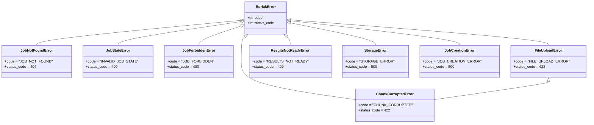

# Error Handling

> **Назначение:** Документация по обработке ошибок в FastAPI бэкенде. Коды ошибок, HTTP-статусы, иерархия исключений.
>
> **Связанные документы:**
> - [`api_reference.md`](api_reference.md) — спецификация эндпоинтов
> - [`fastapi_api_architecture.md`](fastapi_api_architecture.md) — архитектура API

---

## 1. Единый формат ошибки

Все ответы с ошибками возвращаются в едином формате:

```json
{
    "error": {
        "code": "JOB_NOT_FOUND",
        "message": "Job 42 not found",
        "detail": null
    }
}
```

| Поле | Тип | Описание |
|---|---|---|
| `code` | `string` | Машинный код ошибки (UPPER_SNAKE_CASE) |
| `message` | `string` | Человекочитаемое описание |
| `detail` | `any` | Дополнительные данные (опционально) |

---

## 2. Иерархия исключений



---

## 3. Полный справочник кодов ошибок

| Код | HTTP | Исключение | Когда возникает |
|---|---|---|---|
| `JOB_NOT_FOUND` | 404 | `JobNotFoundError` | Запрос задачи по несуществующему ID |
| `INVALID_JOB_STATE` | 409 | `JobStateError` | Операция недопустима в текущем статусе (например, `/start` для уже обрабатываемой задачи) |
| `JOB_FORBIDDEN` | 403 | `JobForbiddenError` | Доступ к задаче запрещён (неверный session_token) |
| `RESULTS_NOT_READY` | 409 | `ResultsNotReadyError` | Попытка скачать результаты до завершения обработки |
| `FILE_UPLOAD_ERROR` | 422 | `FileUploadError` | Неверный `role` (не `bom`/`archive`), отсутствуют обязательные заголовки |
| `CHUNK_CORRUPTED` | 422 | `ChunkCorruptedError` | Размер повторно отправленного чанка не совпадает с сохранённым |
| `STORAGE_ERROR` | 500 | `StorageError` | Ошибка дисковых операций (запись/чтение/сборка) |
| `JOB_CREATION_ERROR` | 500 | `JobCreationError` | Ошибка создания задачи в БД |
| `INTERNAL_ERROR` | 500 | `BurlakError` (базовый) | Непредвиденная ошибка |

---

## 4. Глобальный обработчик

В [`main.py`](../app/main.py) регистрируется глобальный exception handler:

```python
@app.exception_handler(BurlakError)
async def burlak_error_handler(request: Request, exc: BurlakError) -> JSONResponse:
    return JSONResponse(
        status_code=exc.status_code,
        content={
            "error": {
                "code": exc.code,
                "message": str(exc),
                "detail": None,
            }
        },
    )
```

Все необработанные исключения (не наследники `BurlakError`) перехватываются стандартным `500 Internal Server Error` с кодом `INTERNAL_ERROR`.

---

## 5. Примеры ошибок по эндпоинтам

### POST `/api/v1/jobs/{id}/start` — задача не найдена

```json
// HTTP 404
{
    "error": {
        "code": "JOB_NOT_FOUND",
        "message": "Job 999 not found",
        "detail": null
    }
}
```

### POST `/api/v1/jobs/{id}/start` — неверный статус

```json
// HTTP 409
{
    "error": {
        "code": "INVALID_JOB_STATE",
        "message": "Cannot start job 42: current status is 'processing', expected 'awaiting_upload'",
        "detail": null
    }
}
```

### PUT `/api/v1/jobs/{id}/files/bom/chunks/3` — чанк повреждён

```json
// HTTP 422
{
    "error": {
        "code": "CHUNK_CORRUPTED",
        "message": "Chunk 3 for job 42 (role: bom) size mismatch: expected 20971520 bytes, got 10485760 bytes",
        "detail": {
            "expected_bytes": 20971520,
            "received_bytes": 10485760,
            "chunk_index": 3
        }
    }
}
```

### GET `/api/v1/jobs/{id}/results/diff` — результаты не готовы

```json
// HTTP 409
{
    "error": {
        "code": "RESULTS_NOT_READY",
        "message": "Results for job 42 are not ready yet. Current status: 'processing'",
        "detail": null
    }
}
```

### POST `/api/v1/jobs/{id}/cancel` — доступ запрещён

```json
// HTTP 403
{
    "error": {
        "code": "JOB_FORBIDDEN",
        "message": "Invalid session token for job 42",
        "detail": null
    }
}
```

---

## 6. Принципы обработки ошибок

1. **Всегда возвращать единый формат.** Никаких исключений.
2. **Машинные коды — UPPER_SNAKE_CASE.** Клиенты могут полагаться на код, а не на парсинг сообщения.
3. **Сообщения — человекочитаемые.** Содержат ID задачи, ожидаемый/фактический статус, размеры.
4. **detail — для дополнительных данных.** Необязательное поле для структурированной информации (список ошибок, невалидные поля).
5. **Никогда не возвращать stack trace.** В production — только код и сообщение.