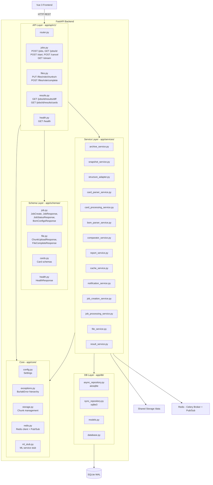
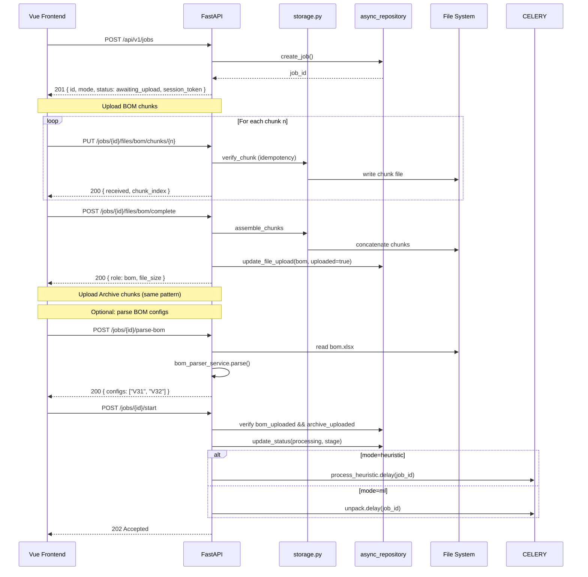
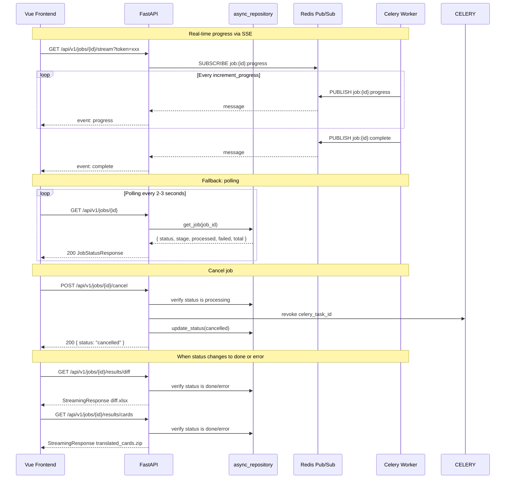

# FastAPI Backend Architecture

> **Назначение:** Данный документ описывает архитектуру FastAPI-бэкенда: структуру пакетов, слои приложения, диаграммы компонентов и потоков данных.
>
> **Связанные документы:**
> - [`container_architecture.md`](container_architecture.md) — C4 Level 2 (контейнеры)
> - [`celery_worker_arc.md`](celery_worker_arc.md) — C4 Level 3 (воркеры)
> - [`technical_specification.md`](technical_specification.md) — детальная спецификация реализации
> - [`api_reference.md`](api_reference.md) — полная спецификация эндпоинтов
> - [`error_handling.md`](error_handling.md) — коды ошибок и обработка
> - [`data_flow.md`](data_flow.md) — сквозной поток данных

---

## 1. Общая архитектура



---

## 2. Структура пакетов

```
burlak-backend/app/
├── api/
│   └── v1/
│       ├── __init__.py
│       ├── router.py            # Агрегатор всех v1 роутеров
│       ├── jobs.py              # POST /jobs, GET /jobs/{id}, POST /start,
│       │                        # POST /cancel, GET /stream, POST /parse-bom
│       ├── files.py             # Чанковая загрузка файлов
│       ├── results.py           # Скачивание результатов
│       └── health.py            # GET /health
│
├── core/
│   ├── __init__.py
│   ├── config.py                # Settings (pydantic-settings)
│   ├── exceptions.py            # Иерархия исключений
│   ├── redis.py                 # Redis-клиент + Pub/Sub
│   ├── storage.py               # Управление файлами и чанками
│   └── ml_stub.py               # Заглушка ML-сервиса для тестов
│
├── schemas/
│   ├── __init__.py
│   ├── job.py                   # Pydantic модели для jobs API
│   ├── cards.py                 # Pydantic модели для cards
│   ├── file.py                  # Pydantic модели для file upload
│   └── health.py                # Pydantic модели для health
│
├── services/
│   ├── __init__.py
│   ├── archive_service.py       # Потоковая работа с ZIP
│   ├── snapshot_service.py      # XLSX → JSON снапшот (300 rows, 200 cols)
│   ├── structure_adapter.py     # Синхронный HTTP-клиент для ML с Circuit Breaker
│   ├── card_parser_service.py   # ML-управляемый парсинг карт
│   ├── card_processing_service.py # Полный пайплайн обработки карты
│   ├── bom_parser_service.py    # Парсинг BOM-файлов
│   ├── comparator_service.py    # Сверка BOM vs карты
│   ├── report_service.py        # Генерация diff.xlsx
│   ├── heuristic_analyzer.py    # Эвристический анализатор (heuristic-режим)
│   ├── splitter.py              # Разделение multi-card листов
│   ├── normalizer.py            # Нормализация наименований
│   ├── fuzzy_matcher.py         # Нечёткое сопоставление
│   ├── validator.py             # Валидация XLSX
│   ├── xls_converter.py         # Конвертация .xls → .xlsx
│   ├── cache_service.py         # Redis cache-aside
│   ├── notification_service.py  # Уведомления (Telegram)
│   ├── file_service.py          # Файловые операции
│   ├── result_service.py        # Сервис результатов
│   ├── job_creation_service.py  # Создание задач
│   └── job_processing_service.py # Диспетчеризация и отмена задач
│
├── db/
│   ├── __init__.py
│   ├── database.py              # SQLAlchemy engine
│   ├── models.py                # Jobs, Cards ORM модели
│   ├── async_repository.py      # Асинхронный репозиторий (aiosqlite)
│   └── sync_repository.py       # Синхронный репозиторий (sqlite3)
│
├── worker/
│   ├── __init__.py
│   ├── celery_app.py            # Celery application + очереди
│   └── tasks/
│       ├── __init__.py
│       ├── unpack.py            # (ML) Распаковка архива
│       ├── analyze_mapping.py   # (ML) Определение структуры через ML
│       ├── process_card.py      # (ML) Обработка карты
│       ├── aggregate.py         # (ML) Финальная сверка
│       ├── package.py           # (ML) Упаковка результатов
│       ├── process_heuristic.py # (Heuristic) Монолитная обработка
│       └── cleanup.py           # Периодическая очистка (Beat)
│
└── main.py                      # FastAPI приложение
```

---

## 3. Слои приложения

### 3.1 Core Layer (`app/core/`)

Центральный слой, от которого зависят все остальные.

| Компонент | Назначение |
|---|---|
| [`config.py`](../app/core/config.py) | `Settings` — загрузка конфигурации из `.env` через `pydantic-settings` |
| [`exceptions.py`](../app/core/exceptions.py) | Иерархия кастомных исключений с HTTP-статусами и кодами |
| [`storage.py`](../app/core/storage.py) | Управление файлами: чанки, сборка, пути |
| [`redis.py`](../app/core/redis.py) | Redis-клиент, Pub/Sub для SSE |
| [`ml_stub.py`](../app/core/ml_stub.py) | Заглушка ML-сервиса для локальной разработки |

### 3.2 Schema Layer (`app/schemas/`)

Pydantic-модели для валидации запросов и сериализации ответов.

| Компонент | Назначение |
|---|---|
| [`job.py`](../app/schemas/job.py) | `JobCreateRequest`, `JobCreateResponse`, `JobStatusResponse`, `JobStartRequest`, `JobStartResponse`, `JobCancelResponse`, `BomConfigsResponse`, `ErrorResponse` |
| [`file.py`](../app/schemas/file.py) | `ChunkUploadResponse`, `FileCompleteResponse` |
| [`cards.py`](../app/schemas/cards.py) | Модели для карт |
| [`health.py`](../app/schemas/health.py) | `HealthResponse` |

### 3.3 API Layer (`app/api/v1/`)

HTTP-роутеры. Только валидация и вызов сервисов — никакой бизнес-логики.

| Роутер | Эндпоинты |
|---|---|
| [`jobs.py`](../app/api/v1/jobs.py) | `POST /api/v1/jobs`, `GET /api/v1/jobs/{id}`, `POST /api/v1/jobs/{id}/start`, `POST /api/v1/jobs/{id}/cancel`, `POST /api/v1/jobs/{id}/parse-bom`, `GET /api/v1/jobs/{id}/stream` |
| [`files.py`](../app/api/v1/files.py) | `PUT /api/v1/jobs/{id}/files/{role}/chunks/{n}`, `POST /api/v1/jobs/{id}/files/{role}/complete` |
| [`results.py`](../app/api/v1/results.py) | `GET /api/v1/jobs/{id}/results/diff`, `GET /api/v1/jobs/{id}/results/cards` |
| [`health.py`](../app/api/v1/health.py) | `GET /api/v1/health` |

### 3.4 Service Layer (`app/services/`)

Бизнес-логика, вызываемая из API-роутеров и Celery-задач.

| Сервис | Назначение |
|---|---|
| [`archive_service.py`](../app/services/archive_service.py) | Потоковое чтение ZIP, упаковка результатов |
| [`snapshot_service.py`](../app/services/snapshot_service.py) | XLSX → JSON снапшот (300 rows, 200 cols, read_only) |
| [`structure_adapter.py`](../app/services/structure_adapter.py) | Синхронный HTTP-клиент для ML с Circuit Breaker |
| [`card_parser_service.py`](../app/services/card_parser_service.py) | ML-управляемый парсинг карт (классификация, извлечение деталей) |
| [`card_processing_service.py`](../app/services/card_processing_service.py) | Полный пайплайн обработки одной карты |
| [`bom_parser_service.py`](../app/services/bom_parser_service.py) | Парсинг BOM-файлов и конфигураций |
| [`comparator_service.py`](../app/services/comparator_service.py) | Сверка материалов с BOM |
| [`report_service.py`](../app/services/report_service.py) | Генерация diff.xlsx |
| [`cache_service.py`](../app/services/cache_service.py) | Redis cache-aside для статусов (TTL 5 сек) |
| [`notification_service.py`](../app/services/notification_service.py) | Уведомления через Telegram |
| [`job_creation_service.py`](../app/services/job_creation_service.py) | Создание задач |
| [`job_processing_service.py`](../app/services/job_processing_service.py) | Диспетчеризация по режиму, отмена задач |

### 3.5 DB Layer (`app/db/`)

Два репозитория над одной SQLite БД в WAL-режиме.

| Компонент | Контекст | Драйвер |
|---|---|---|
| [`async_repository.py`](../app/db/async_repository.py) | FastAPI (async) | `aiosqlite` |
| [`sync_repository.py`](../app/db/sync_repository.py) | Celery workers (sync) | `sqlite3` stdlib |

---

## 4. Диаграмма последовательности: загрузка файлов



---

## 5. Диаграмма последовательности: опрос статуса, SSE и скачивание



---

## 6. Интеграция с существующим кодом

### Все компоненты реализованы

| Файл | Статус |
|---|---|
| [`app/core/config.py`](../app/core/config.py) | Готов — `Settings` со всеми полями |
| [`app/core/exceptions.py`](../app/core/exceptions.py) | Готов — иерархия `BurlakError` |
| [`app/core/storage.py`](../app/core/storage.py) | Готов — чанки, сборка, пути |
| [`app/core/redis.py`](../app/core/redis.py) | Готов — Redis-клиент + Pub/Sub |
| [`app/core/ml_stub.py`](../app/core/ml_stub.py) | Готов — заглушка ML-сервиса |
| [`app/db/models.py`](../app/db/models.py) | Готов — `Jobs` и `Cards` ORM-модели |
| [`app/db/database.py`](../app/db/database.py) | Готов — SQLAlchemy engine + `get_db()` |
| [`app/db/async_repository.py`](../app/db/async_repository.py) | Готов — все async CRUD операции |
| [`app/db/sync_repository.py`](../app/db/sync_repository.py) | Готов — `increment_progress` с `BEGIN IMMEDIATE`, `_publish_progress` |
| [`app/schemas/job.py`](../app/schemas/job.py) | Готов — все Pydantic модели |
| [`app/schemas/file.py`](../app/schemas/file.py) | Готов — модели для загрузки |
| [`app/schemas/cards.py`](../app/schemas/cards.py) | Готов — модели для карт |
| [`app/schemas/health.py`](../app/schemas/health.py) | Готов — модель health check |
| [`app/api/v1/jobs.py`](../app/api/v1/jobs.py) | Готов — все эндпоинты |
| [`app/api/v1/files.py`](../app/api/v1/files.py) | Готов — чанковая загрузка |
| [`app/api/v1/results.py`](../app/api/v1/results.py) | Готов — скачивание результатов |
| [`app/api/v1/health.py`](../app/api/v1/health.py) | Готов — health check |
| [`app/api/v1/router.py`](../app/api/v1/router.py) | Готов — агрегатор роутеров |
| [`app/main.py`](../app/main.py) | Готов — FastAPI приложение с lifespan и exception handlers |
| [`app/worker/celery_app.py`](../app/worker/celery_app.py) | Готов — Celery с очередями |
| [`app/worker/tasks/*.py`](../app/worker/tasks/) | Готов — все 7 задач |
| [`app/services/*.py`](../app/services/) | Готов — все сервисы |

---

## 7. Ключевые архитектурные решения

| Решение | Обоснование |
|---|---|
| **StreamingResponse для скачивания** | Файлы до 1.3 ГБ не должны загружаться в память API-процесса |
| **Чанковая загрузка (20 MB)** | Стабильная передача больших файлов через HTTP с возможностью resume |
| **Идемпотентность чанков** | Безопасные повторные отправки при сетевых таймаутах |
| **Два репозитория БД** | FastAPI (async) + Celery (sync) — разные драйверы для разных контекстов |
| **BEGIN IMMEDIATE в sync_repository** | Предотвращение deadlock'ов при конкурентной записи в WAL-режиме |
| **Атомарный счётчик вместо Celery Chord** | Надёжная координация 1000+ воркеров без тяжёлых аккордов |
| **Два режима обработки** | Heuristic (по умолчанию, без ML) и ML (с внешним сервисом) |
| **SSE через Redis Pub/Sub** | Real-time прогресс без блокировки API-процесса |
| **Redis cache-aside** | Статус задачи кешируется (TTL 5 сек) для быстрых GET-запросов |
| **Circuit Breaker для ML** | 5 ошибок → 60 сек блокировки → `ManualResponseNeededError` |
| **Синхронный HTTP-клиент для ML** | Celery-воркеры работают в синхронном контексте, async не нужен |