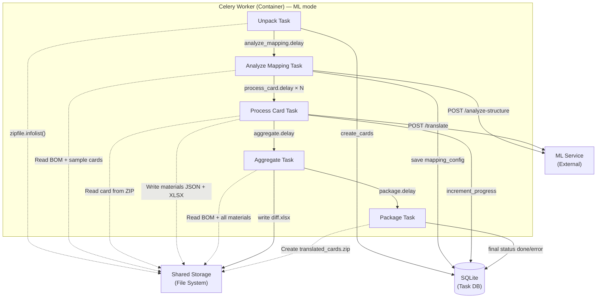
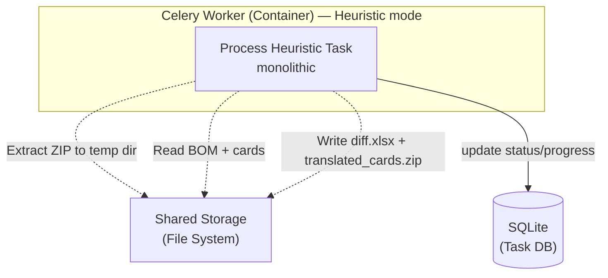

# Архитектурное описание компонента: Celery Worker Container (C4 — Level 3)

> **Связанные документы:**
> - [`container_architecture.md`](container_architecture.md) — C4 Level 2 (контейнеры)
> - [`technical_specification.md`](technical_specification.md) — детальная спецификация реализации
> - [`fastapi_api_architecture.md`](fastapi_api_architecture.md) — архитектура FastAPI бэкенда
> - [`data_flow.md`](data_flow.md) — сквозной поток данных через все компоненты системы

## 1. Общее описание

Данный документ описывает внутреннюю структуру, зоны ответственности и логику взаимодействия компонентов внутри контейнера **Celery Worker**. Контейнер отвечает за фоновую обработку технологических карт (ETL-пайплайн), взаимодействие с ML-сервисом перевода (в ML-режиме) и финальную предикативную сверку с эталонным BOM.

Система поддерживает **два режима обработки**, выбираемых при создании задачи:

1. **Heuristic-режим (`mode="heuristic"`, по умолчанию):** Монолитная задача [`process_heuristic`](app/worker/tasks/process_heuristic.py), которая выполняет все шаги последовательно, используя встроенную библиотеку `burlak_parser`. Не требует внешнего ML-сервиса.

2. **ML-режим (`mode="ml"`):** Цепочка из 5 Celery-задач, описанная ниже.

**Стадии ML-пайплайна:**
- `unpacking` → [`unpack`](app/worker/tasks/unpack.py)
- `analyzing_mapping` → [`analyze_mapping`](app/worker/tasks/analyze_mapping.py)
- `processing_cards` → [`process_card`](app/worker/tasks/process_card.py)
- `aggregating` → [`aggregate`](app/worker/tasks/aggregate.py)
- `packaging` → [`package`](app/worker/tasks/package.py)

**Стадии heuristic-пайплайна (все в одной задаче [`process_heuristic`](app/worker/tasks/process_heuristic.py)):**
- `extracting_cards` — распаковка ZIP во временную директорию
- `unpacking` — подсчёт Excel-файлов
- `parsing_bom` — парсинг BOM через `burlak_parser.bom_parser`
- `parsing_cards` — парсинг карт через `burlak_parser.card_parser`
- `splitting_cards` — разделение multi-sheet карт
- `comparing` — сравнение BOM vs карты
- `generating_report` — создание `diff.xlsx` и `translated_cards.zip`

---

## 2. Спецификация компонентов

### 2.1. Celery Application (Точка входа)

**Файл:** [`app/worker/celery_app.py`](app/worker/celery_app.py)

**Тип:** Экземпляр Celery, сконфигурированный с Redis как брокер и бэкенд результатов.

**Конфигурация:**
- Брокер: `settings.redis_url` (Redis LPUSH/BRPOP — Pull-модель)
- Сериализация: JSON (pickle отключён для безопасности)
- Время ожидания: soft limit 10500с, hard limit 10800с
- Retry: до 3 попыток, экспоненциальная задержка
- Очереди: `unpack`, `mapping`, `cards`, `aggregate`, `heuristic`, `cleanup`

**Маршрутизация задач по очередям:**
| Задача | Очередь |
|---|---|
| `unpack` | `unpack` |
| `analyze_mapping` | `mapping` |
| `process_card` | `cards` |
| `aggregate` | `aggregate` |
| `package` | `aggregate` |
| `process_heuristic` | `heuristic` |
| `cleanup_old_jobs` | `cleanup` |

**Периодические задачи (Celery Beat):**
- `cleanup_old_jobs` — каждый час, удаляет задачи старше 24 часов

---

### 2.2. Модуль: Unpack Task (Распаковка архива) — только ML-режим

**Соответствие файлу:** [`app/worker/tasks/unpack.py`](app/worker/tasks/unpack.py)

**Обязанности:**
- Потоковое чтение оглавления ZIP-архива через `zipfile.ZipFile.infolist()` (без физической распаковки на диск).
- Фильтрация: исключение скрытых файлов, macOS-метаданных (`__MACOSX`), включение только `.xlsx`/`.xls`.
- Создание записей о картах в БД (таблица `cards`) через `sync_repository.create_cards()`.
- Установка `total` в jobs.
- Перевод задачи на стадию `analyzing_mapping` и запуск `analyze_mapping.delay(job_id)`.

**Важно:** В heuristic-режиме распаковка выполняется иначе — задача `process_heuristic` физически распаковывает ZIP во временную директорию через `tempfile.mkdtemp()` + `zipfile.extractall()`.

---

### 2.3. Модуль: Analyze Mapping Task (Определение структуры через ML) — только ML-режим

**Соответствие файлу:** [`app/worker/tasks/analyze_mapping.py`](app/worker/tasks/analyze_mapping.py)

**Обязанности:**
- Чтение BOM и репрезентативных карт из Shared Storage/ZIP.
- Извлечение JSON-слепков через [`snapshot_service.extract_snapshot_from_bytes()`](app/services/snapshot_service.py) (первые **300 строк** каждого листа, макс. **200 колонок**).
- Группировка карт по формату через [`snapshot_service.group_by_format()`](app/services/snapshot_service.py).
- Отправка JSON-слепков в ML-сервис (`POST /api/v1/analyze-structure`) через [`StructureAdapter.analyze_structure()`](app/services/structure_adapter.py).
- Сохранение результата в `jobs.mapping_config` через `sync_repository.update_mapping_config()`.
- Перевод задачи на стадию `processing_cards` и запуск `process_card.delay()` для каждой карты.

**Внутренние подкомпоненты:**

#### Snapshot Service (Извлечение JSON-слепков)
- **Файл:** [`app/services/snapshot_service.py`](app/services/snapshot_service.py)
- **Функции:**
  - `extract_snapshot_from_bytes(data, filename, max_rows=300)` — читает XLSX из `io.BytesIO` через `openpyxl` (read_only), извлекает первые N строк, обрезает хвостовые null-колонки, пропускает пустые строки.
  - `group_by_format(file_paths)` — группирует файлы по префиксу имени (например, `ABC-AS-001` и `ABC-AS-002` → группа `ABC-AS-`).
- **Важно:** Все операции in-memory, без записи на диск. Колонки ограничены 200.

#### Structure Adapter (HTTP-клиент ML)
- **Файл:** [`app/services/structure_adapter.py`](app/services/structure_adapter.py)
- **Тип:** Синхронный `httpx.Client` (Celery-воркеры работают в синхронном контексте).
- **Методы:**
  - `analyze_structure(snapshot)` → `POST /api/v1/analyze-structure` → `mapping_config`
  - `translate_batch(texts, source_lang="zh", target_lang="en")` → `POST /api/v1/translate` (пакетами по 200 строк)
- **Отказоустойчивость:** Circuit breaker (5 ошибок → 60 сек cooldown), обработка `503 ManualResponseNeededError`.

---

### 2.4. Модуль: Process Card Task (Обработка карт) — только ML-режим

**Соответствие файлу:** [`app/worker/tasks/process_card.py`](app/worker/tasks/process_card.py)

Инкапсулирует логику поштучной обработки входящих файлов. Работает параллельно на множестве воркеров.

**Внутренние подкомпоненты:**

#### Card Processing Service (Сервис обработки карты)
- **Файл:** [`app/services/card_processing_service.py`](app/services/card_processing_service.py)
- **Обязанности:**
  - Чтение карты из ZIP через `zf.read(card_path)` (в память).
  - Конвертация `.xls` → `.xlsx` через LibreOffice (если необходимо).
  - Классификация файла через `CardParserService.classify_with_format_and_content()`.
  - Для multi-sheet карт: разделение на отдельные файлы через `CardSplitter`.
  - Для multi-card листов: разделение на sub-card по границам.
  - Парсинг через `CardParserService.parse_card()`.
  - Перевод уникальных строк через `StructureAdapter.translate_batch()`.
  - Сохранение результатов:
    - Оригинальный XLSX (без изменений, чтобы сохранить изображения) в `translated_cards/{safe_name}`
    - JSON с материалами в `card_materials/{safe_name}.json`
  - Запись error-файла (`{safe_name}_error.json`) при ошибке.

#### Card Parser Service (ML-управляемый парсер)
- **Файл:** [`app/services/card_parser_service.py`](app/services/card_parser_service.py)
- **Обязанности:**
  - Классификация файлов по правилам из `mapping_config.cards.file_classification_rules` (поддерживает `filename_regex`, `filename_keyword`, `sheet_keyword`).
  - Парсинг operational card по координатам из `mapping_config`:
    - Номера колонок: `part_no`, `qty`, `name`
    - Границы таблицы: `header_rows`, `data_start_row`, `end_markers`
    - Multi-card поддержка: разделение по пустым строкам с повторяющимися заголовками
  - Auto-detect fallback: если mapping_config не подошёл, сканирует заголовки по ключевым словам.
  - Нормализация part-number и quantity через [`normalizer`](app/services/normalizer.py).

#### Structure Adapter (HTTP-клиент ML)
- **Файл:** [`app/services/structure_adapter.py`](app/services/structure_adapter.py)
- **Метод:** `translate_batch(texts, target_lang="ru")` — синхронный, пакетами по 200 строк.
- **Важно:** Синхронный (`httpx.Client`), не асинхронный. Celery-воркеры не используют `asyncio`.

#### Атомарная синхронизация (вместо Celery Chord)
- **Файл:** [`app/db/sync_repository.py`](app/db/sync_repository.py)
- **Метод:** `increment_progress(job_id, card_path, success, error_message)`.
- **Обязанности:**
  - `BEGIN IMMEDIATE` транзакция для WAL-безопасности.
  - Идемпотентное обновление статуса карты (pending → success/failed).
  - Атомарный инкремент счётчиков `processed`/`failed` в jobs.
  - Проверка: если `processed + failed == total`, возвращает `is_complete=True`.
  - Публикация прогресса в Redis Pub/Sub для SSE.
  - Воркер при `is_complete=True` запускает `aggregate.delay(job_id)`.

---

### 2.5. Модуль: Final Aggregator (Финальная сверка и сборка) — только ML-режим

**Соответствие файлам:** [`app/worker/tasks/aggregate.py`](app/worker/tasks/aggregate.py) и [`app/worker/tasks/package.py`](app/worker/tasks/package.py)

Запускается строго один раз, когда все задачи `process_card` завершены (триггер — атомарная проверка счетчика в SQLite).

**Внутренние подкомпоненты:**

#### BOM Loader
- **Файл:** [`app/services/bom_parser_service.py`](app/services/bom_parser_service.py)
- **Обязанности:**
  - Парсинг BOM через `parse_bom(bom_path, sheets_config=...)` с использованием `mapping_config.bom.sheets`.
  - Если config-based парсинг дал 0 деталей — fallback на `auto_detect_bom_sheets()`.
  - **Не использует Pandas DataFrame** — парсинг через `burlak_parser.bom_parser.BOMService`.

#### Material Summarizer
- **Файл:** Логика в [`app/worker/tasks/aggregate.py`](app/worker/tasks/aggregate.py)
- **Обязанности:**
  - Сканирует директорию `card_materials/` в Shared Storage.
  - Загружает все JSON-файлы (кроме `*_error.json`).
  - Агрегирует part-номера с суммированием количеств.
  - Загружает failed cards из БД через `sync_repository.get_failed_cards()`.
  - **Частичный отчет:** Агрегатор успешно собирает отчет даже при наличии ошибок в некоторых картах.

#### Comparator Engine
- **Файл:** [`app/services/comparator_service.py`](app/services/comparator_service.py)
- **Обязанности:**
  - Выполняет сравнение BOM vs карты через `compare_all_configs(bom, cards_data, use_fuzzy=True)`.
  - Проверка целостности через `verify_integrity(result)`.
  - **Не использует Pandas** — используется `burlak_parser.comparator` с fuzzy matching.

#### Report Packager
- **Файл:** [`app/services/report_service.py`](app/services/report_service.py) + [`app/worker/tasks/package.py`](app/worker/tasks/package.py)
- **Обязанности:**
  - Генерирует финальный документ `diff.xlsx` через `generate_discrepancy_report()`.
  - Архивирует все файлы из `translated_cards/` в `translated_cards.zip` (включая `split_cards/`).
  - Производит финальную запись статуса в SQLite (`status: done` или `status: error`, если `failed > 0`).

---

## 3. Политика обработки ошибок и отказоустойчивости (Fault Tolerance)

### 3.1. ML-режим

1. **Изоляция сбоев при обработке карт:**
   - При возникновении ошибки в `process_card`, задача делает `self.retry()` (до 3 попыток с экспоненциальной задержкой).
   - После исчерпания retry: пишется error-файл `{safe_name}_error.json`, вызывается `increment_progress(success=False)`.
   - Счетчик `failed` увеличивается атомарно.

2. **ManualResponseNeededError:** Если ML-сервис в ручном режиме (503), задача НЕ retry-ится — сразу переводит job в `error` со стадией `ml_manual_response_needed`.

3. **Circuit Breaker:** `StructureAdapter` имеет circuit breaker (5 ошибок → 60 сек cooldown) для предотвращения каскадных таймаутов.

### 3.2. Heuristic-режим

1. **Retry:** `process_heuristic` имеет до 2 retry с экспоненциальной задержкой.
2. **Temp-директория:** Временная директория гарантированно удаляется в `finally` блоке.
3. **Corrupted files:** Если `cards.corrupted_files > 0`, статус `error` со стадией `completed_with_errors`.

### 3.3. Общие механизмы

1. **Частичный отчет:** Агрегатор успешно собирает отчет даже при наличии ошибок в некоторых картах.
2. **Graceful degradation:** Если `failed > 0` по итогам обработки, статус задачи переводится в `error`, но результаты (diff.xlsx, translated_cards.zip) всё равно доступны для скачивания.
3. **WAL-safe транзакции:** Все операции с SQLite из Celery-задач используют `BEGIN IMMEDIATE` для предотвращения deadlock'ов.

---

## 4. Диаграмма компонентов (Mermaid)

### 4.1. ML-режим

### 4.2. Heuristic-режим
