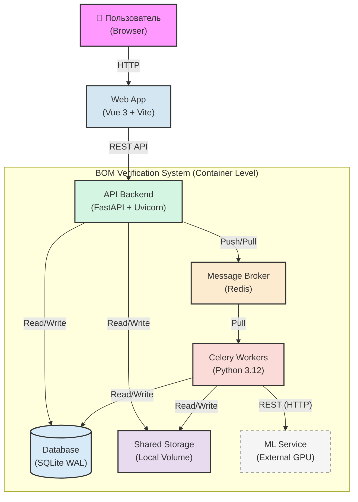

# Архитектура контейнеров (C4 Level 2)

> **Назначение:** Данный документ описывает систему на уровне контейнеров (C4 Level 2) — высокоуровневую архитектуру, компоненты и сквозной поток данных. Не содержит деталей реализации, контрактов API или внутренней структуры воркеров.
>
> **Связанные документы:**
> - [`technical_specification.md`](technical_specification.md) — детальная спецификация реализации (стек, State Machine, API, файловая структура)
> - [`celery_worker_arc.md`](celery_worker_arc.md) — внутренняя архитектура Celery Worker (C4 Level 3)
> - [`fastapi_api_architecture.md`](fastapi_api_architecture.md) — архитектура FastAPI бэкенда (слои, компоненты, диаграммы)
> - [`api_reference.md`](api_reference.md) — полная спецификация эндпоинтов с примерами запросов/ответов
> - [`error_handling.md`](error_handling.md) — коды ошибок, иерархия исключений, примеры
> - [`data_flow.md`](data_flow.md) — сквозной поток данных через все компоненты системы
> - [`ml_service_contract.md`](ml_service_contract.md) — контракт ML-сервиса анализа структуры

---

## 1. Общее описание системы

Система представляет собой **асинхронное сервис-ориентированное приложение (Event-Driven Mini-Service)**, спроектированное для высоконагруженной потоковой обработки тяжелых инженерных данных в изолированном контуре.

**Характеристики обрабатываемых данных:**

| Тип данных | Типичный вес | Описание |
|---|---|---|
| BOM-таблица | до 5.5 МБ | Эталонная спецификация материалов (Bill of Materials) |
| Архив операционных карт | до 1.3 ГБ | ZIP-архив, содержащий ~1000 Excel-файлов технологических карт |

**Окружение:** Закрытый изолированный контур. Reverse Proxy (Nginx) не используется — FastAPI выступает единой точкой входа для API, а фронтенд (Vue 3) раздается статически или работает в режиме разработки через Vite dev server.

---

## 2. Диаграмма контейнеров (Mermaid)



---

## 3. Компоненты системы (Контейнеры)

### 3.1. Web App (Vue 3 + Vite)

| Свойство | Значение |
|---|---|
| **Роль** | Клиентский интерфейс пользователя |
| **Технология** | Vue 3 + Vite + TypeScript |
| **Исполнение** | Браузер пользователя |

**Обязанности:**
- Нарезка тяжелых архивов на чанки (куски по 20 МБ, конфигурируется через `CHUNK_SIZE_BYTES`) для стабильной загрузки через HTTP
- Поштучная отправка чанков с подтверждением (использует `useChunkedUpload.ts`)
- Подписка на real-time прогресс через SSE (`EventSource`) — `GET /jobs/{id}/stream?token=xxx`
- Опрос бэкенда по REST API (`GET /jobs/{id}`) как fallback-механизм
- Выбор конфигураций BOM перед стартом обработки (`POST /jobs/{id}/parse-bom`)
- Интерфейс для скачивания результатов (diff-отчет + переведенные карты)
- Валидация файлов перед отправкой (расширение, размер)

**Ключевые модули фронтенда:**
| Модуль | Назначение |
|---|---|
| `FileUploader.vue` | Главный компонент загрузки файлов |
| `useChunkedUpload.ts` | Логика чанковой загрузки (composable) |
| `uploadStore.ts` | Управление состоянием загрузки (Pinia store) |

---

### 3.2. API Backend (FastAPI + Uvicorn)

| Свойство | Значение |
|---|---|
| **Роль** | Единая точка входа для API, асинхронный HTTP-сервер |
| **Технология** | FastAPI + Uvicorn (Python 3.12) |
| **Протокол** | REST (JSON) |
| **Порт** | 8000 (по умолчанию) |

**Обязанности:**
- Прием HTTP-запросов от фронтенда (загрузка файлов, запуск задач, опрос статуса, скачивание результатов)
- Прием чанков файлов и склейка их напрямую на диск (Shared Storage)
- Регистрация задач в базе данных (SQLite) с указанием режима: `mode="heuristic"` (по умолчанию) или `mode="ml"`
- Отправка сигналов в очередь (Redis) для запуска фоновой обработки
- Моментальный возврат ответа клиенту, не дожидаясь окончания обработки (асинхронный паттерн)
- Потоковая отдача готовых файлов клиенту через `StreamingResponse`
- Real-time трансляция прогресса через SSE (Server-Sent Events) на базе Redis Pub/Sub
- Endpoint `/health` для проверки состояния системы

**Основные эндпоинты:**
| Метод | Путь | Назначение |
|---|---|---|
| `POST` | `/api/v1/jobs` | Создать задачу (`mode: "heuristic"` или `"ml"`) |
| `PUT` | `/api/v1/jobs/{id}/files/{role}/chunks/{n}` | Загрузить чанк файла (`role: bom` или `archive`) |
| `POST` | `/api/v1/jobs/{id}/files/{role}/complete` | Подтвердить загрузку файла |
| `POST` | `/api/v1/jobs/{id}/parse-bom` | Распарсить BOM и получить список конфигураций |
| `POST` | `/api/v1/jobs/{id}/start` | Запустить обработку (с опциональным `selected_configs`) |
| `GET` | `/api/v1/jobs/{id}` | Получить статус задачи (с Redis-кэшем) |
| `GET` | `/api/v1/jobs/{id}/stream` | SSE-поток прогресса (через Redis Pub/Sub) |
| `POST` | `/api/v1/jobs/{id}/cancel` | Отменить выполняющуюся задачу |
| `GET` | `/api/v1/jobs/{id}/results/diff` | Скачать `diff.xlsx` |
| `GET` | `/api/v1/jobs/{id}/results/cards` | Скачать `translated_cards.zip` |
| `GET` | `/api/v1/health` | Проверка состояния системы |

**Почему без Nginx:** Система работает в закрытом изолированном контуре без высокой нагрузки. FastAPI + Uvicorn самостоятельно обрабатывает входящие запросы, включая загрузку тяжелых файлов. Reverse Proxy не требуется.

---

### 3.3. Message Broker (Redis)

| Свойство | Значение |
|---|---|
| **Роль** | Брокер сообщений / очередь задач / Pub/Sub для SSE |
| **Технология** | Redis (in-memory) |
| **Модель** | Pull (воркеры сами забирают задачи) |

**Обязанности:**
- Хранение очереди подзадач (Celery task queue) для координации воркеров
- Распределение нагрузки между воркерами по Pull-модели
- Хранение результатов выполнения задач (Celery result backend)
- Быстрая передача триггеров между FastAPI и Celery Workers
- **Pub/Sub для real-time прогресса:** Celery-задачи публикуют обновления прогресса в канал `job:{id}:progress`, FastAPI транслирует их клиентам через SSE
- **Кэш статусов задач:** Redis используется как cache-aside для `GET /jobs/{id}` (TTL 5 секунд)

---

### 3.4. Celery Workers (Python 3.12)

| Свойство | Значение |
|---|---|
| **Роль** | Изолированный пул вычислительных воркеров |
| **Технология** | Celery + Python 3.12 |
| **Модель** | Параллельные процессы (prefork) с очередями |

**Два режима обработки:**

Система поддерживает два режима, выбираемых при создании задачи (`POST /api/v1/jobs`):

1. **Heuristic-режим (`mode="heuristic"`, по умолчанию):** Монолитная задача [`process_heuristic`](app/worker/tasks/process_heuristic.py) в очереди `heuristic`. Использует встроенную библиотеку `burlak_parser` — не требует внешнего ML-сервиса. Выполняет все шаги последовательно: распаковка ZIP → парсинг BOM → парсинг карт → разделение multi-sheet → сравнение → генерация отчёта.

2. **ML-режим (`mode="ml"`):** Цепочка из 5 Celery-задач, каждая в своей очереди:
   - `unpack` (очередь `unpack`) — чтение ZIP, создание записей карт
   - `analyze_mapping` (очередь `mapping`) — отправка снэпшотов в ML-сервис
   - `process_card` (очередь `cards`) — обработка каждой карты через ML
   - `aggregate` (очередь `aggregate`) — сверка BOM vs карты, генерация `diff.xlsx`
   - `package` (очередь `aggregate`) — упаковка `translated_cards.zip`

**Очереди Celery:**
| Очередь | Задачи | Назначение |
|---|---|---|
| `unpack` | `unpack` | Распаковка архива (ML-режим) |
| `mapping` | `analyze_mapping` | Анализ структуры через ML |
| `cards` | `process_card` | Обработка карт (ML-режим) |
| `aggregate` | `aggregate`, `package` | Агрегация и упаковка |
| `heuristic` | `process_heuristic` | Полный heuristic-пайплайн |
| `cleanup` | `cleanup_old_jobs` | Периодическая очистка (Celery Beat) |

**Обязанности:**
- Параллельное выполнение тяжелых CPU-bound операций:
  - Парсинг Excel через `openpyxl` (в heuristic-режиме — с распаковкой на диск)
  - Очистка и нормализация данных
- Выступление в роли HTTP-клиентов для внешней ML-машины (GPU) — только в ML-режиме
- Атомарное обновление прогресса в SQLite (инкремент счетчика через `BEGIN IMMEDIATE`)
- Публикация прогресса в Redis Pub/Sub для SSE
- Запуск финальной агрегации при завершении всех подзадач (атомарный счётчик вместо Celery Chord)
- Периодическая очистка старых задач (Celery Beat, каждый час)

**Внутренняя архитектура детально описана в [`celery_worker_arc.md`](celery_worker_arc.md).**

---

### 3.5. Database (SQLite WAL)

| Свойство | Значение |
|---|---|
| **Роль** | Легковесная реляционная БД |
| **Технология** | SQLite (режим WAL) |
| **Формат** | Файл на диске (путь из `settings.sqlite_db_path`) |

**Обязанности:**
- Хранение истории задач (таблица `jobs`)
- Хранение записей об отдельных картах (таблица `cards`)
- Хранение логов ошибок
- Точный счетчик прогресса (атомарный инкремент через `BEGIN IMMEDIATE`)

**Модель данных:**

**Таблица `jobs`:**
| Поле | Тип | Описание |
|---|---|---|
| `id` | int (PK) | ID задачи |
| `session_token` | str | Токен для аутентификации |
| `mode` | str | `heuristic` или `ml` |
| `status` | str | `awaiting_upload`, `processing`, `done`, `error` |
| `stage` | str? | Текущая стадия обработки |
| `total` | int | Всего карт к обработке |
| `processed` | int | Успешно обработано |
| `failed` | int | С ошибками |
| `bom_path` | str? | Путь к BOM-файлу |
| `archive_path` | str? | Путь к архиву карт |
| `bom_uploaded` | bool | Флаг загрузки BOM |
| `archive_uploaded` | bool | Флаг загрузки архива |
| `mapping_config` | JSON? | Конфигурация маппинга от ML |
| `selected_config` | str? | Выбранные конфигурации BOM (JSON-массив или строка) |
| `celery_task_id` | str? | ID задачи Celery (для отмены) |
| `error` | str? | Сообщение об ошибке |

**Таблица `cards`:**
| Поле | Тип | Описание |
|---|---|---|
| `id` | int (PK) | ID карты |
| `job_id` | int (FK → jobs) | Родительская задача |
| `card_path` | str | Путь к файлу карты в архиве |
| `status` | str | `pending`, `success`, `failed` |
| `error_message` | str? | Ошибка обработки карты |

Связь: `Jobs 1──N Cards` (каскадное удаление).

**Режим WAL (Write-Ahead Logging)** позволяет воркерам параллельно записывать статус, а бэкенду — читать его для фронтенда без блокировок (конкурентное чтение-запись). Все транзакции в Celery-задачах используют `BEGIN IMMEDIATE` для предотвращения взаимоблокировок.

---

### 3.6. Shared Storage (Local Volume)

| Свойство | Значение |
|---|---|
| **Роль** | Общее файловое хранилище |
| **Технология** | Docker Volume (локальный диск) |
| **Путь по умолчанию** | `/data` (конфигурируется через `STORAGE_PATH`) |
| **Доступ** | FastAPI + Celery Workers (read/write) |

**Структура директорий:**
```
{storage_path}/
└── {job_id}/
    ├── chunks/                  # Временные чанки при загрузке
    ├── bom.xlsx                 # Собранный BOM-файл
    ├── archive.zip              # Загруженный архив карт
    ├── card_materials/          # JSON-файлы материалов по каждой карте
    ├── translated_cards/        # Обработанные XLSX-карты
    ├── split_cards/             # Разделённые multi-sheet карты (для heuristic)
    ├── diff.xlsx                # Финальный отчёт о расхождениях
    └── translated_cards.zip     # Архив обработанных карт
```

**Обязанности:**
- Хранение исходных тяжелых файлов (BOM.xlsx, ZIP-архивы с картами)
- Хранение промежуточных отчетов (JSON-файлы материалов по каждой карте в `card_materials/`)
- Хранение финальных результатов (`diff.xlsx`, `translated_cards.zip`)
- Автоматическая очистка данных старше 24 часов через Celery Beat-задачу `cleanup_old_jobs` (каждый час)

---

### 3.7. ML Service (External, опционально)

| Свойство | Значение |
|---|---|
| **Роль** | Внешний сервис анализа структуры и перевода (только для `mode="ml"`) |
| **Технология** | GPU-ускоренная нейросеть |
| **Протокол** | REST (HTTP/JSON) |
| **Адрес по умолчанию** | `http://ml-service:8000` (конфигурируется через `ML_SERVICE_URL`) |

**Обязанности:**
- **Анализ структуры:** Принимает JSON-слепок структуры Excel (первые **300 строк** каждого листа, макс. 200 колонок) и возвращает схему: координаты колонок, строки начала данных, ключи сопоставления (`mapping_config`). Зона ответственности AI минимальна — не извлекает данные, только описывает координаты.
- **Перевод:** Принимает пул уникальных строк (пакетами до 200) и возвращает переведенные соответствия.

**Эндпоинты ML-сервиса:**
| Метод | Путь | Назначение |
|---|---|---|
| `POST` | `/api/v1/analyze-structure` | Анализ структуры Excel → `mapping_config` |
| `POST` | `/api/v1/translate` | Пакетный перевод строк |

**Клиент:** Синхронный `httpx.Client` в [`StructureAdapter`](app/services/structure_adapter.py) (Celery-воркеры работают в синхронном контексте). Включает circuit breaker (5 ошибок → 60 сек cooldown).

**Важно:** ML-сервис требуется **только** для `mode="ml"`. В режиме `mode="heuristic"` (по умолчанию) используется встроенная библиотека `burlak_parser` без внешних зависимостей.

**Детальное описание взаимодействия с ML-сервисом на уровне воркера см. в [`celery_worker_arc.md`](celery_worker_arc.md) (раздел 2.3 Analyze Mapping Task).**

---

## 4. Сквозной жизненный цикл задачи (Data Flow)

Жизненный цикл зависит от выбранного режима. Ниже описаны общие этапы и различия.

### 4.1. Загрузка (общая для обоих режимов)

```
Браузер (Vue) → FastAPI → Shared Storage
```

1. Фронтенд (Vue 3) нарезает архив на чанки (размер из `CHUNK_SIZE_BYTES`, по умолчанию 20 МБ) через `useChunkedUpload.ts`
2. Чанки передаются напрямую в FastAPI (без промежуточного proxy)
3. FastAPI склеивает чанки и сохраняет файл в Shared Storage
4. Бэкенд создает запись в SQLite (статус: `awaiting_upload`, режим: `heuristic` или `ml`)
5. После подтверждения загрузки всех файлов фронтенд может вызвать `POST /jobs/{id}/parse-bom` для получения списка конфигураций BOM
6. Фронтенд вызывает `POST /jobs/{id}/start` (опционально с `selected_configs`)
7. Бэкенд атомарно переводит статус в `processing` и отправляет задачу в Celery
8. Пользователь сразу видит прогресс-бар через SSE (`GET /jobs/{id}/stream`) или polling (`GET /jobs/{id}`)

### 4.2. Heuristic-режим (mode="heuristic", по умолчанию)

```
FastAPI → Redis → Celery Worker (process_heuristic) → Shared Storage → SQLite
```

Одна монолитная задача `process_heuristic` выполняет все шаги последовательно:

1. **extracting_cards:** Распаковывает ZIP-архив во временную директорию (`tempfile.mkdtemp`)
2. **unpacking:** Подсчитывает количество Excel-файлов для прогресс-бара
3. **parsing_bom:** Парсит BOM через `burlak_parser.bom_parser.BOMService` (эвристический, без ML)
4. **parsing_cards:** Парсит все карты через `burlak_parser.card_parser.CardService` (с коллбеком прогресса)
5. **splitting_cards:** Разделяет multi-sheet карты на отдельные файлы через `split_cards_to_files`
6. **comparing:** Сравнивает BOM со всеми картами через `compare_all_configs` (fuzzy matching)
7. **generating_report:** Создаёт `diff.xlsx` и `translated_cards.zip`
8. **Финал:** Устанавливает статус `done` или `error` (если были повреждённые файлы)

**Real-time прогресс:** Задача публикует обновления в Redis Pub/Sub → FastAPI транслирует через SSE.

### 4.3. ML-режим (mode="ml")

#### 4.3.1. Распаковка архива (Unpack Task)

```
Shared Storage → Celery Worker (Unpack Task) → SQLite → Redis
```

1. Первый свободный Celery Worker открывает оглавление ZIP-архива **без распаковки** (streaming через `zipfile.infolist()`)
2. Считывает список Excel-файлов (карт)
3. Создает записи в таблице `cards` (SQLite) со статусом `pending`
4. Устанавливает `total` в jobs
5. Запускает `analyze_mapping.delay(job_id)`

#### 4.3.2. Анализ структуры (Analyze Mapping Task)

```
Celery Worker → Shared Storage → ML Service → SQLite → Redis
```

1. Читает BOM и репрезентативные карты из Shared Storage
2. Извлекает JSON-слепки через `extract_snapshot_from_bytes` (первые 300 строк, макс. 200 колонок)
3. Отправляет в ML-сервис `POST /api/v1/analyze-structure`
4. Сохраняет `mapping_config` в SQLite
5. Запускает `process_card.delay(job_id, card_path)` для каждой карты

#### 4.3.3. Обработка карт (Process Card Task)

Выполняется параллельно на N воркерах.

1. Каждый воркер читает карту из ZIP через `zf.read(card_path)` (в память)
2. Классифицирует файл через `CardParserService` (по правилам из `mapping_config`)
3. Для operational card: парсит данные, извлекает материалы
4. Переводит уникальные строки через ML-сервис (`POST /api/v1/translate`)
5. Сохраняет:
   - Оригинальный XLSX в `translated_cards/{safe_name}`
   - JSON с материалами в `card_materials/{safe_name}.json`
6. Атомарно инкрементирует счётчик в SQLite (`BEGIN IMMEDIATE`)
7. Если `processed + failed == total` — запускает `aggregate.delay(job_id)`

#### 4.3.4. Агрегация и сверка (Aggregate Task)

```
SQLite (счётчик) → Celery Worker (Aggregate Task) → Shared Storage
```

1. Загружает BOM через `bom_parser_service.parse_bom()` с использованием `mapping_config`
2. Собирает все JSON-файлы из `card_materials/`
3. Выполняет сравнение через `compare_all_configs()` (fuzzy matching)
4. Генерирует `diff.xlsx`
5. Запускает `package.delay(job_id)`

#### 4.3.5. Упаковка (Package Task)

1. Создаёт `translated_cards.zip` из директории `translated_cards/`
2. Устанавливает финальный статус: `done` (если `failed == 0`) или `error` (если `failed > 0`)

### 4.4. Real-time прогресс (SSE)

Для обоих режимов работает одинаково:

1. Celery-задачи вызывают `sync_repository.update_job_status()` или `increment_progress()`
2. Эти методы публикуют обновление в Redis Pub/Sub: канал `job:{id}:progress`
3. FastAPI endpoint `GET /jobs/{id}/stream?token=xxx` подписан на этот канал
4. Данные транслируются клиенту как Server-Sent Events

### 4.5. Выдача результата

```
Shared Storage → FastAPI → Браузер (Vue)
```

1. Фронтенд получает статус `done` или `error` через SSE или polling
2. Пользователь инициирует GET-запрос на `/jobs/{id}/results/diff` или `/jobs/{id}/results/cards`
3. FastAPI потоком (`StreamingResponse`) отдает готовые файлы с диска клиенту

---

## 5. Принципы архитектуры

| Принцип | Описание |
|---|---|
| **Two Modes** | Система поддерживает два режима: `heuristic` (встроенный парсер, без внешних зависимостей) и `ml` (ML-пайплайн через внешний сервис). Режим выбирается при создании задачи |
| **Event-Driven** | Все компоненты общаются через асинхронные сообщения (Redis), а не синхронные вызовы |
| **Stateless API** | FastAPI не хранит состояние задач — вся информация в SQLite и Redis |
| **Pull-модель** | Воркеры сами забирают задачи из очереди, а не получают их принудительно |
| **Streaming I/O** | Тяжелые файлы читаются потоково; результаты отдаются через `StreamingResponse` |
| **Fault Isolation** | Сбой одного воркера не влияет на остальные; битые карты не блокируют общий прогресс |
| **Idempotency** | Повторная отправка чанка или повторный запуск задачи безопасны |
| **No Orchestrator** | Отказ от Celery Chord — триггер агрегации через атомарный счетчик в SQLite |
| **Real-time Progress** | Прогресс транслируется через Redis Pub/Sub → SSE, с кэшированием статуса в Redis (cache-aside, TTL 5с) |
| **Graceful Retry** | Каждая Celery-задача имеет до 3 повторных попыток с экспоненциальной задержкой |