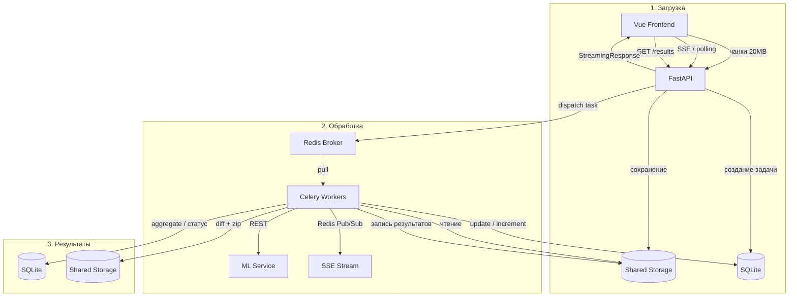

# Data Flow

> **Назначение:** Документ описывает сквозной поток данных через все компоненты системы — от загрузки файлов до выдачи результатов.
>
> **Связанные документы:**
> - [`container_architecture.md`](container_architecture.md) — C4 Level 2 (контейнеры)
> - [`celery_worker_arc.md`](celery_worker_arc.md) — C4 Level 3 (воркеры)
> - [`fastapi_api_architecture.md`](fastapi_api_architecture.md) — архитектура API
> - [`api_reference.md`](api_reference.md) — спецификация эндпоинтов

---

## 1. Общая схема потока



---

## 2. Этап 1: Загрузка файлов

### 2.1. Создание задачи

```
Frontend                    FastAPI                     SQLite
   │                          │                          │
   │  POST /api/v1/jobs       │                          │
   │  { "mode": "heuristic" } │                          │
   │  (или "ml")              │                          │
   │─────────────────────────>│                          │
   │                          │  INSERT INTO jobs        │
   │                          │  (mode, status:          │
   │                          │   awaiting_upload)       │
   │                          │─────────────────────────>│
   │                          │<─────────────────────────│
   │  201 { id, mode,         │                          │
   │        status,           │                          │
   │        session_token }   │                          │
   │<─────────────────────────│                          │
```

### 2.2. Чанковая загрузка BOM

```
Frontend                    FastAPI                 Shared Storage
   │                          │                          │
   │  PUT /files/bom/chunks/0 │                          │
   │  X-Total-Chunks: 5       │                          │
   │  [20 MB binary]          │                          │
   │─────────────────────────>│                          │
   │                          │  verify_chunk (idemp.)   │
   │                          │  write {job}/chunks/     │
   │                          │─────────────────────────>│
   │  200 { received, idx }   │                          │
   │<─────────────────────────│                          │
   │                          │                          │
   │  ... (повтор для чанков 1-4) ...                    │
   │                          │                          │
   │  POST /files/bom/complete│                          │
   │─────────────────────────>│                          │
   │                          │  assemble_chunks         │
   │                          │  concatenate → bom.xlsx  │
   │                          │─────────────────────────>│
   │                          │                          │
   │  200 { role, size }      │                          │
   │<─────────────────────────│                          │
```

### 2.3. Загрузка архива

Аналогично BOM, но с `role: archive`. После завершения:

```
Frontend                    FastAPI                     SQLite
   │                          │                          │
   │  POST /jobs/{id}/start   │                          │
   │  { "selected_configs":   │                          │
   │    ["V31", "V32"] }      │                          │
   │─────────────────────────>│                          │
   │                          │  verify bom_uploaded     │
   │                          │  verify archive_uploaded │
   │                          │                          │
   │                          │  UPDATE jobs             │
   │                          │  SET status=processing   │
   │                          │  SET stage=unpacking     │
   │                          │  (или extracting_cards   │
   │                          │   для heuristic)         │
   │                          │─────────────────────────>│
   │                          │                          │
   │                          │  dispatch_processing:    │
   │                          │  mode=heuristic →        │
   │                          │    process_heuristic.delay│
   │                          │  mode=ml →               │
   │                          │    unpack.delay           │
   │                          │─────────────────────────>│
   │                          │              (Redis)     │
   │  202 Accepted            │                          │
   │<─────────────────────────│                          │
```

**Опционально:** перед `/start` фронтенд может вызвать `POST /jobs/{id}/parse-bom` для получения списка доступных конфигураций BOM и передать выбранные в `selected_configs`.

---

## 3. Этап 2: Обработка

### 3.0. Эвристический режим (Heuristic Task)

В режиме `mode="heuristic"` (по умолчанию) весь пайплайн выполняется в рамках одной Celery-задачи [`process_heuristic`](../app/worker/tasks/process_heuristic.py:62) без обращения к внешнему ML-сервису.

```
Celery Worker               Shared Storage              SQLite
   │                              │                        │
   │  process_heuristic(job_id)   │                        │
   │                              │                        │
   │  UPDATE status=processing    │                        │
   │  stage=extracting_cards      │                        │
   │──────────────────────────────────────────────────────>│
   │                              │                        │
   │  extract archive → temp dir  │                        │
   │─────────────────────────────>│                        │
   │                              │                        │
   │  burlak_parser:              │                        │
   │  ┌─────────────────────┐     │                        │
   │  │ splitter → card_    │     │                        │
   │  │ parser → comparator │     │                        │
   │  │ → report_generator  │     │                        │
   │  └─────────────────────┘     │                        │
   │                              │                        │
   │  write diff.xlsx             │                        │
   │─────────────────────────────>│                        │
   │                              │                        │
   │  write translated_cards.zip  │                        │
   │─────────────────────────────>│                        │
   │                              │                        │
   │  UPDATE status=done/error    │                        │
   │──────────────────────────────────────────────────────>│
```

**Ключевые отличия от ML-режима:**
- Не требует загрузки BOM (работает только с архивом карт)
- Не использует Celery chain (одна задача от начала до конца)
- Не вызывает внешний ML-сервис
- Прогресс публикуется через `_card_progress` / `_split_progress` callback'и
- Использует `ProcessPoolExecutor` для параллельной обработки карт

---

### 3.1. Распаковка архива (Unpack Task — только ML-режим)

```
Celery Worker               Shared Storage              SQLite
   │                              │                        │
   │  unpack(job_id)              │                        │
   │                              │                        │
   │  zipfile.infolist()          │                        │
   │─────────────────────────────>│                        │
   │  список ~1000 карт           │                        │
   │<─────────────────────────────│                        │
   │                              │                        │
   │  INSERT INTO cards × 1000    │                        │
   │──────────────────────────────────────────────────────>│
   │                              │                        │
   │  UPDATE jobs SET total=1000  │                        │
   │──────────────────────────────────────────────────────>│
   │                              │                        │
   │  analyze_mapping.delay()     │                        │
   │─────────────────────────────>│                        │
   │                   (Redis)    │                        │
```

### 3.2. Анализ структуры (Analyze Mapping Task — только ML-режим)

```
Celery Worker           Shared Storage          ML Service              SQLite
   │                          │                      │                    │
   │  analyze_mapping(id)     │                      │                    │
   │                          │                      │                    │
   │  read BOM.xlsx           │                      │                    │
   │─────────────────────────>│                      │                    │
   │  read sample cards       │                      │                    │
   │  (через zf.read())       │                      │                    │
   │─────────────────────────>│                      │                    │
   │                          │                      │                    │
   │  extract JSON snapshot   │                      │                    │
   │  (300 строк, макс 200    │                      │                    │
   │   колонок, в памяти      │                      │                    │
   │   через io.BytesIO)      │                      │                    │
   │                          │                      │                    │
   │  POST /analyze           │                      │                    │
   │────────────────────────────────────────────────>│                    │
   │                          │                      │                    │
   │  mapping_config          │                      │                    │
   │<────────────────────────────────────────────────│                    │
   │                          │                      │                    │
   │  UPDATE jobs             │                      │                    │
   │  SET mapping_config=...  │                      │                    │
   │  SET stage=processing    │                      │                    │
   │──────────────────────────────────────────────────────────────────────>│
   │                          │                      │                    │
   │  process_card.delay() × 1000                    │                    │
   │─────────────────────────>│                      │                    │
   │              (Redis)     │                      │                    │
```

### 3.3. Обработка карт (Process Card Task — только ML-режим)

Выполняется параллельно на N воркерах.

```
Celery Worker N           Shared Storage          ML Service              SQLite
   │                              │                      │                    │
   │  process_card(id, path)      │                      │                    │
   │                              │                      │                    │
   │  zf.read(card_path)          │                      │                    │
   │─────────────────────────────>│                      │                    │
   │  XLSX bytes (in-memory)      │                      │                    │
   │<─────────────────────────────│                      │                    │
   │                              │                      │                    │
   │  parse card using            │                      │                    │
   │  mapping_config              │                      │                    │
   │  (CardParserService)         │                      │                    │
   │                              │                      │                    │
   │  extract unique strings      │                      │                    │
   │                              │                      │                    │
   │  translate_batch (sync)      │                      │                    │
   │────────────────────────────────────────────────────>│                    │
   │  translated strings          │                      │                    │
   │<────────────────────────────────────────────────────│                    │
   │                              │                      │                    │
   │  write translated_cards/     │                      │                    │
   │  {safe_name}/ (XLSX)         │                      │                    │
   │─────────────────────────────>│                      │                    │
   │                              │                      │                    │
   │  write card_materials/       │                      │                    │
   │  {safe_name}.json            │                      │                    │
   │─────────────────────────────>│                      │                    │
   │                              │                      │                    │
   │  BEGIN IMMEDIATE             │                      │                    │
   │  UPDATE cards SET status     │                      │                    │
   │  UPDATE jobs SET processed++ │                      │                    │
   │─────────────────────────────────────────────────────────────────────────>│
   │                              │                      │                    │
   │  if processed+failed==total: │                      │                    │
   │    aggregate.delay(id)       │                      │                    │
   │─────────────────────────────>│                      │                    │
   │                   (Redis)    │                      │                    │
```

### 3.4. Атомарный инкремент прогресса

Ключевой механизм координации. Вместо Celery Chord используется атомарный счётчик в SQLite.

```python
# sync_repository.py
def increment_progress(job_id, card_path, *, success, error_message=None):
    conn.execute("BEGIN IMMEDIATE")
    
    # 1. Проверка текущего статуса карты (идемпотентность)
    card = conn.execute("SELECT status FROM cards WHERE ...")
    
    # 2. Расчёт дельт (processed_delta, failed_delta)
    #    pending→success:  +1 processed
    #    pending→failed:   +1 failed
    #    success→failed:   -1 processed, +1 failed
    #    failed→success:   +1 processed, -1 failed
    
    # 3. UPDATE cards SET status
    # 4. UPDATE jobs SET processed+=delta, failed+=delta
    
    # 5. Проверка завершения
    is_complete = (processed + failed == total)
    
    conn.commit()
    return ProgressResult(is_complete, processed, failed, total)
```

---

## 4. Этап 3: Агрегация и результаты

### 4.1. Финальная сверка (Aggregate Task — только ML-режим)

```
Celery Worker           Shared Storage              SQLite
   │                              │                    │
   │  aggregate(job_id)           │                    │
   │                              │                    │
   │  UPDATE stage=aggregating    │                    │
   │──────────────────────────────────────────────────>│
   │                              │                    │
   │  read BOM.xlsx               │                    │
   │  (bom_parser_service)        │                    │
   │─────────────────────────────>│                    │
   │                              │                    │
   │  read all card_materials/    │                    │
   │  *.json                      │                    │
   │─────────────────────────────>│                    │
   │                              │                    │
   │  compare BOM vs materials    │                    │
   │  (comparator_service)        │                    │
   │                              │                    │
   │  generate diff.xlsx          │                    │
   │  (report_service)            │                    │
   │─────────────────────────────>│                    │
   │                              │                    │
   │  package.delay(job_id)       │                    │
   │─────────────────────────────>│                    │
   │                   (Redis)    │                    │
   │                              │                    │
   │  if failed > 0:              │                    │
   │    UPDATE status = error     │                    │
   │  else:                       │                    │
   │    UPDATE status = done      │                    │
   │──────────────────────────────────────────────────>│
```

### 4.2. Упаковка результатов (Package Task — только ML-режим)

```
Celery Worker           Shared Storage              SQLite
   │                              │                    │
   │  package(job_id)             │                    │
   │                              │                    │
   │  UPDATE stage=packaging      │                    │
   │──────────────────────────────────────────────────>│
   │                              │                    │
   │  read translated_cards/      │                    │
   │─────────────────────────────>│                    │
   │                              │                    │
   │  create translated_cards.zip │                    │
   │─────────────────────────────>│                    │
   │                              │                    │
   │  cleanup temp dir            │                    │
   │─────────────────────────────>│                    │
   │                              │                    │
   │  UPDATE status=done          │                    │
   │──────────────────────────────────────────────────>│
```

### 4.3. SSE-стрим прогресса (Real-time)

Фронтенд подписывается на прогресс через Server-Sent Events:

```
Frontend                    FastAPI                     Redis
   │                          │                          │
   │  GET /jobs/{id}/stream   │                          │
   │  ?token=<session_token>  │                          │
   │─────────────────────────>│                          │
   │                          │  SUBSCRIBE job:{id}      │
   │                          │─────────────────────────>│
   │                          │                          │
   │                          │  ┌──────────────────────┐│
   │                          │  │  Celery Worker        ││
   │                          │  │  publish to           ││
   │                          │  │  Redis Pub/Sub:       ││
   │                          │  │  job:{id}:progress    ││
   │                          │  └──────────────────────┘│
   │                          │                          │
   │  event: progress         │                          │
   │  data: {"processed": 5,  │                          │
   │         "failed": 0,     │                          │
   │         "total": 100,    │                          │
   │         "stage": "cards" }                          │
   │<─────────────────────────│                          │
   │                          │                          │
   │  event: progress         │                          │
   │  data: {"processed": 10, │                          │
   │         "failed": 1,     │                          │
   │         "total": 100 }   │                          │
   │<─────────────────────────│                          │
   │                          │                          │
   │  event: complete         │                          │
   │  data: {"status": "done" │                          │
   │         "stage": "done"} │                          │
   │<─────────────────────────│                          │
```

**Механизм:**
1. [`_publish_progress`](../app/db/sync_repository.py:38) вызывается после каждого `increment_progress`
2. Публикует JSON в Redis Pub/Sub на канал `job:{id}:progress`
3. FastAPI SSE-endpoint [`GET /jobs/{id}/stream`](../app/api/v1/jobs.py:97) подписывается на этот канал
4. Токен аутентификации (`session_token`) передаётся как query-параметр
5. Дополнительно используется Redis cache-aside (TTL 5 сек) для быстрого GET /jobs/{id}

### 4.4. Поллинг статуса

```
Frontend                    FastAPI                     SQLite
   │                          │                          │
   │  GET /jobs/{id}          │                          │
   │  (каждые 2-3 сек)        │                          │
   │─────────────────────────>│                          │
   │                          │  SELECT * FROM jobs      │
   │                          │  (или Redis cache)       │
   │                          │─────────────────────────>│
   │                          │<─────────────────────────│
   │  200 { status, stage,    │                          │
   │        processed, total }│                          │
   │<─────────────────────────│                          │
```

### 4.5. Скачивание результатов

```
Frontend                    FastAPI                 Shared Storage
   │                          │                          │
   │  GET /results/diff       │                          │
   │─────────────────────────>│                          │
   │                          │  verify status done/error│
   │                          │                          │
   │                          │  StreamingResponse       │
   │                          │  open(diff.xlsx)         │
   │                          │─────────────────────────>│
   │  200 OK                  │                          │
   │  Content-Type: xlsx      │                          │
   │  <streaming binary>      │                          │
   │<─────────────────────────│                          │
```

---

## 5. Сводная таблица: что куда пишется

| Данные | Откуда | Куда | Формат |
|---|---|---|---|
| Чанки файлов | Frontend → FastAPI | `{storage}/{job}/chunks/{role}_{n}.part` | Бинарный |
| Собранный BOM | FastAPI | `{storage}/{job}/bom.xlsx` | XLSX |
| Собранный архив | FastAPI | `{storage}/{job}/archive.zip` | ZIP |
| Задача (job) | FastAPI | SQLite `jobs` | Row |
| Карты (cards) | Unpack Task | SQLite `cards` | Row |
| mapping_config | Analyze Mapping Task | SQLite `jobs.mapping_config` | JSON |
| Материалы карты | Process Card Task | `{storage}/{job}/card_materials/{safe_name}.json` | JSON |
| Переведённая карта | Process Card Task | `{storage}/{job}/translated_cards/{safe_name}/` | XLSX (директория) |
| diff.xlsx | Aggregate Task | `{storage}/{job}/diff.xlsx` | XLSX |
| translated_cards.zip | Package Task | `{storage}/{job}/translated_cards.zip` | ZIP |