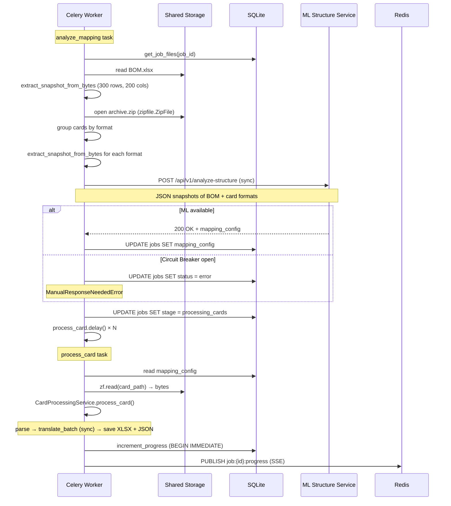

# ML-сервис анализа структуры: контракт и архитектура

> **Статус:** Реализовано. Документ отражает фактический контракт между бэкендом и ML-сервисом.
> **Цель:** Определить, как ML-сервис получает данные об Excel-файлах и сообщает о структуре для парсера в Celery Worker.

---

## 1. Контекст и предпосылки

1.  Парсер в Celery Worker (ML-режим) полагается на `mapping_config` от ML-сервиса.
2. **BOM-файлы и операционные карты могут быть в разных форматах.** ML-сервис должен уметь определять структуру для каждого формата.
3. **Бэкенд перед отправкой в ML конвертирует Excel в JSON-снапшот через `snapshot_service.extract_snapshot_from_bytes()`.** Используется `openpyxl` (read_only) в памяти через `io.BytesIO`.
4. **ML-сервис не имеет доступа к Shared Storage.** Все данные передаются через HTTP (JSON).
5. **Бэкенд отправляет несколько BOM-файлов и несколько операционных карт разных форматов.** Бэкенд группирует файлы по формату (по шаблону имени файла) и отправляет representative-слепок каждого уникального формата.

---

## 2. Как бэкенд формирует JSON-слепок для ML

### 2.1. Принцип

Бэкенд открывает Excel-файл через `openpyxl` (read_only) и извлекает:
- Имена всех листов
- Для каждого листа — первые 300 строк (сырые значения ячеек), макс 200 колонок
- Мета-информацию: количество строк, количество колонок

**Группировка по форматам:** Бэкенд группирует файлы по формату (по шаблону/маске имени файла) и отправляет **representative-слепки каждого уникального формата** в ML-сервис. Размер слепка — **300 строк** с каждого листа, макс **200 колонок**.

### 2.2. Фактическая реализация (`snapshot_service.py`)

```python
# app/services/snapshot_service.py
def extract_snapshot_from_bytes(
    data: bytes,
    filename: str,
    max_rows: int = 300,
    max_cols: int = 200,
) -> dict:
    """
    Извлечь JSON-слепок Excel-файла из байтового потока для отправки в ML-сервис.
    
    Args:
        data: Байты XLSX-файла.
        filename: Имя файла (для мета-информации).
        max_rows: Сколько строк брать с каждого листа (по умолч. 300).
        max_cols: Максимальное количество колонок (по умолч. 200).
    
    Returns:
        dict: {
            "filename": "BOM.xlsx",
            "sheets": [
                {
                    "sheet_name": "总装BOM",
                    "total_rows": 1500,
                    "total_cols": 30,
                    "rows": [["A1", "B1", ...], ["A2", "B2", ...], ...]
                }
            ]
        }
    """
    wb = openpyxl.load_workbook(io.BytesIO(data), read_only=True, data_only=True)
    result = {
        "filename": filename,
        "sheets": []
    }
    
    for sheet_name in wb.sheetnames:
        ws = wb[sheet_name]
        # Ограничиваем считывание колонок до 200
        max_col = min(ws.max_column or 0, max_cols)
        
        rows = []
        for row_idx, row in enumerate(ws.iter_rows(
            min_row=1, max_row=max_rows, max_col=max_col, values_only=True
        ), start=1):
            row_values = []
            for value in row:
                if value is None:
                    row_values.append(None)
                elif isinstance(value, (int, float)):
                    row_values.append(value)
                else:
                    row_values.append(str(value))
            rows.append(row_values)
        
        result["sheets"].append({
            "sheet_name": sheet_name,
            "total_rows": ws.max_row or 0,
            "total_cols": max_col,
            "rows": rows
        })
    
    wb.close()
    return result
```

**Ключевые отличия от черновика:**
- Функция называется `extract_snapshot_from_bytes`, принимает `bytes`, а не `file_path`
- Поле называется `filename` (без подчёркивания), а не `file_name`
- Нет поля `total_sheets` (определяется по длине массива `sheets`)
- Используется `read_only=True` для производительности
- Максимум колонок: 200 (не 50)
- Используется `ws.iter_rows()` вместо `ws.cell()` для производительности

### 2.3. Что попадает в JSON-слепок

| Данные | Откуда | Пример |
|--------|--------|--------|
| Имя файла | Параметр `filename` | `"BOM.xlsx"` |
| Имя листа | `ws.title` | `"总装BOM"` |
| Всего строк | `ws.max_row` | `1500` |
| Всего колонок | `min(ws.max_column, 200)` | `30` |
| Значения ячеек | `ws.iter_rows(values_only=True)` | `"零件号"`, `"S1110001"`, `2` |

**Важно:** Значения передаются как есть (int, float, str, None). ML-сервис сам решает, что с ними делать.

---

## 3. Контракт ML-сервиса

### 3.1. Эндпоинт

```
POST /api/v1/analyze-structure
Content-Type: application/json
```

### 3.2. Запрос (Request)

**Важно:** `bom` и `sample_cards` — это массивы. Бэкенд группирует все BOM-файлы и все операционные карты по форматам и отправляет representative-слепок каждого уникального формата. Размер слепка — 300 строк с каждого листа, макс 200 колонок.

```json
{
  "bom": [
    {
      "filename": "BOM.xlsx",
      "format_group": "BOM_standard",
      "sheets": [
        {
          "sheet_name": "总装BOM",
          "total_rows": 1500,
          "total_cols": 30,
          "rows": [
            ["序号", "零件号", "零件名称", "零件名称(英文)", "用量", "V31", "V32", "V33"],
            [1, "S1110001", "螺栓M6×20", "Bolt M6×20", 2, "S", 1, "S"],
            [2, "S1110002", "螺母M8", "Nut M8", 4, 1, "S", 2],
            [3, "S1110003", "垫圈", "Washer", 4, "S", "S", "S"]
          ]
        },
        {
          "sheet_name": "封面",
          "total_rows": 5,
          "total_cols": 2,
          "rows": [
            ["项目", "内容"],
            ["车型", "XXX"],
            ["版本", "V1.0"]
          ]
        },
        {
          "sheet_name": "变更记录",
          "total_rows": 10,
          "total_cols": 4,
          "rows": [
            ["版本", "日期", "变更内容", "编制"],
            ["V1.0", "2024-01-01", "初版", "张三"]
          ]
        }
      ]
    },
    {
      "filename": "BOM_export.xlsx",
      "format_group": "BOM_export",
      "sheets": [
        {
          "sheet_name": "Sheet1",
          "total_rows": 800,
          "total_cols": 15,
          "rows": [
            ["Part No", "Part Name", "Qty", "Remark"],
            ["S1110001", "Bolt M6×20", 2, null],
            ["S1110002", "Nut M8", 4, null]
          ]
        }
      ]
    }
  ],
  "sample_cards": [
    {
      "filename": "SQRT1L-17-AS-04001.xlsx",
      "format_group": "card_format_A",
      "sheets": [
        {
          "sheet_name": "Sheet1",
          "total_rows": 300,
          "total_cols": 10,
          "rows": [
            ["序号", "零件号", "名称", "数量", "备注"],
            [1, "S1110001", "螺栓M6×20", 2, null],
            [2, "S1110004", "螺母M10", 4, null]
          ]
        }
      ]
    },
    {
      "filename": "G01-A-AS-05001.xlsx",
      "format_group": "card_format_B",
      "sheets": [
        {
          "sheet_name": "操作1",
          "total_rows": 30,
          "total_cols": 8,
          "rows": [
            ["零件号", "名称", "数量"],
            ["S1110001", "螺栓M6×20", 2]
          ]
        },
        {
          "sheet_name": "操作2",
          "total_rows": 25,
          "total_cols": 8,
          "rows": [
            ["零件号", "名称", "数量"],
            ["S1110005", "螺钉M4", 6]
          ]
        }
      ]
    }
  ],
  "options": {
    "max_sample_rows": 300,
    "total_cards_in_archive": 1000,
    "language_hint": "zh-CN"
  }
}
```

### 3.3. Ответ (Response) — `200 OK`

ML-сервис возвращает `mapping_config` — полное описание структуры для парсера.

```json
{
  "status": "success",
  "mapping_config": {
    "bom": {
      "sheets": [
        {
          "sheet_name": "总装BOM",
          "sheet_type": "bom_data",
          "header_rows": [1],
          "data_start_row": 2,
          "total_data_rows_estimate": 1500,
          "columns": {
            "part_no": {
              "col_index": 2,
              "header": "零件号",
              "confidence": 0.98
            },
            "name_cn": {
              "col_index": 3,
              "header": "零件名称",
              "confidence": 0.95
            },
            "name_en": {
              "col_index": 4,
              "header": "零件名称(英文)",
              "confidence": 0.92
            },
            "qty": {
              "col_index": 5,
              "header": "用量",
              "confidence": 0.97
            },
            "config_columns": [
              {
                "col_index": 6,
                "header": "V31",
                "type": "config",
                "confidence": 0.90
              },
              {
                "col_index": 7,
                "header": "V32",
                "type": "config",
                "confidence": 0.90
              },
              {
                "col_index": 8,
                "header": "V33",
                "type": "config",
                "confidence": 0.90
              }
            ]
          },
          "layout": {
            "type": "single_table",
            "description": "Стандартная таблица BOM"
          }
        },
        {
          "sheet_name": "封面",
          "sheet_type": "service",
          "header_rows": [],
          "data_start_row": 0,
          "columns": {},
          "layout": {
            "type": "service_sheet",
            "description": "Служебный лист обложка"
          }
        },
        {
          "sheet_name": "变更记录",
          "sheet_type": "service",
          "header_rows": [],
          "data_start_row": 0,
          "columns": {},
          "layout": {
            "type": "service_sheet",
            "description": "Служебный лист история изменений"
          }
        }
      ]
    },
    "cards": {
      "formats": {
        "card_format_A": {
          "structure_type": "standard_table",
          "description": "Операционные карты со стандартной таблицей деталей. Номер карты извлекается из имени файла по паттерну Префикс-AS-Номер.",
          "card_number_source": "filename",
          "card_number_pattern": "^[A-Za-z0-9]+-[A-Za-z0-9]*-AS-\\d+",
          "card_number_confidence": 0.92,
          "sheets": [
            {
              "sheet_name": null,
              "sheet_type": "card_data",
              "header_rows": [1],
              "data_start_row": 2,
              "columns": {
                "part_no": {
                  "col_index": 2,
                  "header": "零件号",
                  "confidence": 0.95
                },
                "name_cn": {
                  "col_index": 3,
                  "header": "名称",
                  "confidence": 0.90
                },
                "qty": {
                  "col_index": 4,
                  "header": "数量",
                  "confidence": 0.97
                }
              },
              "table_boundaries": {
                "type": "end_markers",
                "markers": ["物料清单", "变更记录", "编制", "校对", "审核", "批准"],
                "empty_rows_threshold": 3
              }
            }
          ]
        },
        "card_format_B": {
          "structure_type": "standard_table",
          "description": "Технологические карты 工艺卡片. Один файл содержит несколько карт, разделённых пустой строкой.",
          "card_number_source": "cell",
          "card_number_pattern": "CM-[A-Z0-9]+",
          "card_number_confidence": 0.90,
          "sheets": [
            {
              "sheet_name": null,
              "sheet_type": "card_data",
              "header_rows": [1],
              "data_start_row": 2,
              "columns": {
                "part_no": {
                  "col_index": 18,
                  "header": "零部件代号",
                  "confidence": 0.95
                },
                "name_cn": {
                  "col_index": 0,
                  "header": null,
                  "confidence": 0.0
                },
                "qty": {
                  "col_index": 0,
                  "header": null,
                  "confidence": 0.0
                }
              },
              "table_boundaries": {
                "type": "multi_card",
                "multi_card": {
                  "separator_type": "empty_row",
                  "empty_rows_separator": 1,
                  "has_repeating_header": true,
                  "parts_header_row": 1,
                  "parts_data_start_row": 2,
                  "max_cards": 0
                }
              }
            }
          ]
        }
      },
      "file_classification_rules": {
        "operational_card_patterns": [
          {
            "type": "filename_regex",
            "pattern": "^[A-Za-z0-9]+-[A-Za-z0-9]*-AS-\\d+",
            "format_group": "card_format_A"
          },
          {
            "type": "filename_regex",
            "pattern": "^[A-Za-z]{1,3}\\d{2,}",
            "format_group": "card_format_A"
          },
          {
            "type": "filename_regex",
            "pattern": "^\\d{2,}",
            "format_group": "card_format_A"
          },
          {
            "type": "sheet_keyword",
            "keywords": ["作业指导书", "作业要领书", "操作指导", "工艺卡", "工序卡"],
            "format_group": "card_format_A"
          }
        ],
        "service_file_patterns": [
          {
            "type": "filename_keyword",
            "keywords": ["封面", "目录", "记录表", "空表", "填写范本", "填写说明", "工时汇总", "对比"]
          },
          {
            "type": "filename_keyword",
            "keywords": ["обложка", "содержание", "cover", "toc", "template"]
          }
        ]
      }
    },
    "mapping": {
      "bom_to_card": {
        "part_no": {
          "bom_column": "part_no",
          "card_column": "part_no",
          "match_type": "exact",
          "confidence": 0.95
        },
        "name": {
          "bom_column": "name_cn",
          "card_column": "name_cn",
          "match_type": "fuzzy",
          "confidence": 0.90
        },
        "quantity": {
          "bom_column": "qty",
          "card_column": "qty",
          "match_type": "exact",
          "confidence": 0.97
        }
      }
    },
    "metadata": {
      "analyzer_version": "1.0.0",
      "processing_time_ms": 450,
      "model": "gpt-4o",
      "warnings": [
        "Не удалось определить name_en для карт"
      ]
    }
  }
}
```

---

## 4. Как mapping_config используется парсером

### 4.1. Analyze Mapping Task (фактическая реализация)

Фактическая реализация в [`analyze_mapping.py`](../app/worker/tasks/analyze_mapping.py:18):

```python
def analyze_mapping(self, job_id):
    # 1. Получаем пути к BOM и архиву
    bom_path, archive_path = sync_repository.get_job_files(job_id)
    
    # 2. Читаем BOM и извлекаем снапшот
    with open(bom_path, "rb") as f:
        bom_data = f.read()
    bom_snapshot = extract_snapshot_from_bytes(bom_data, os.path.basename(bom_path))
    bom_snapshot["format_group"] = "BOM"
    
    # 3. Группируем карты в архиве по форматам
    with zipfile.ZipFile(archive_path, "r") as zf:
        all_paths = [p for p in zf.namelist() if p.endswith(".xlsx")]
        card_groups = group_by_format(all_paths)
        
        card_snapshots = []
        for group_name, paths in card_groups.items():
            card_data = zf.read(paths[0])
            snapshot = extract_snapshot_from_bytes(
                card_data, os.path.basename(paths[0])
            )
            snapshot["format_group"] = group_name
            card_snapshots.append(snapshot)
    
    # 4. Отправляем в ML-сервис через StructureAdapter
    try:
        with StructureAdapter(settings.ml_service_url) as ml_client:
            mapping_config = ml_client.analyze_structure({
                "bom": [bom_snapshot],
                "sample_cards": card_snapshots,
                "options": {
                    "max_sample_rows": 300,
                    "total_cards_in_archive": len(all_paths)
                }
            })
    except ManualResponseNeededError:
        mark_job_error(job_id, "ML_SERVICE_UNAVAILABLE")
        return
    
    # 5. Сохраняем в БД
    sync_repository.update_job_status(job_id, "processing", "mapping_config", mapping_config)
    
    # 6. Запускаем обработку карт
    sync_repository.update_job_status(job_id, "processing", "processing_cards")
    for card_path in all_paths:
        process_card.delay(job_id, card_path)
```

### 4.2. Process Card Task (фактическая реализация)

Фактическая реализация делегирует обработку [`CardProcessingService`](../app/services/card_processing_service.py:64):

```python
def process_card(self, job_id, card_path):
    try:
        # Весь пайплайн в CardProcessingService
        service = CardProcessingService(job_id, card_path)
        service.process_card(card_path)
        
        # Инкрементируем прогресс (success)
        progress = sync_repository.increment_progress(job_id, card_path, success=True)
        if progress.is_complete:
            aggregate.delay(job_id)
            
    except Exception as e:
        logger.error(f"Failed to process card {card_path}: {e}")
        progress = sync_repository.increment_progress(
            job_id, card_path, success=False, error_message=str(e)
        )
        if progress.is_complete:
            aggregate.delay(job_id)
```

**CardProcessingService.process_card()** выполняет:
1. Чтение карты из ZIP через `zf.read(card_path)`
2. Конвертация `.xls` → `.xlsx` при необходимости (через `xls_converter`)
3. Парсинг через `CardParserService` с использованием `mapping_config`
4. Извлечение уникальных строк для перевода
5. `StructureAdapter.translate_batch(texts)` — синхронный batch-перевод
6. Сохранение оригинальных XLSX-байт в `translated_cards/{safe_name}/`
7. Сохранение материалов в `card_materials/{safe_name}.json`
8. Обработка multi-card листов (один XLSX → несколько карт)

---

## 5. Полная спецификация mapping_config

*(Структура mapping_config полностью соответствует описанной в разделах 5.1–5.4 оригинального черновика. Изменения не требуются.)*

---

## 6. Формат ошибок ML-сервиса

```json
{
  "status": "error",
  "error": {
    "code": "INVALID_INPUT",
    "message": "BOM data is empty or malformed",
    "detail": {
      "missing_fields": ["bom[0].sheets"]
    }
  }
}
```

| Код | HTTP | Описание |
|-----|------|----------|
| `INVALID_INPUT` | 422 | Неверный формат запроса |
| `ANALYSIS_FAILED` | 500 | ML не смог проанализировать структуру |
| `TIMEOUT` | 504 | Превышено время обработки |
| `RATE_LIMITED` | 429 | Слишком много запросов |

---

## 7. Фактические компоненты бэкенда

### 7.1. `app/services/snapshot_service.py`

Сервис для извлечения JSON-слепков из Excel-файлов через openpyxl (read_only).

```python
class SnapshotService:
    @staticmethod
    def extract_snapshot_from_bytes(
        data: bytes, filename: str, max_rows: int = 300, max_cols: int = 200
    ) -> dict: ...
    
    @staticmethod
    def group_by_format(file_paths: list[str]) -> dict[str, list[str]]: ...
```

### 7.2. `app/services/structure_adapter.py`

**Синхронный** HTTP-клиент для ML-сервиса с Circuit Breaker.

```python
class StructureAdapter:
    """Синхронный HTTP-клиент для ML-сервиса с Circuit Breaker."""
    
    def __init__(self, base_url: str, timeout: float = 300.0):
        self._client = httpx.Client(base_url=base_url, timeout=timeout)
        self._circuit_breaker = _CircuitBreaker()
    
    def analyze_structure(self, payload: dict) -> dict:
        """POST /api/v1/analyze-structure — синхронно."""
        ...
    
    def translate_batch(self, texts: list[str]) -> list[str]:
        """POST /api/v1/translate — синхронный batch-перевод."""
        ...
```

**Ключевые отличия от черновика:**
- Использует `httpx.Client` (синхронный), а не `httpx.AsyncClient`
- Методы синхронные, без `async`
- Добавлен `_CircuitBreaker`: 5 failures → 60s cooldown
- Добавлен `translate_batch` для перевода
- Добавлен `ManualResponseNeededError` при разомкнутом circuit breaker

### 7.3. `app/worker/tasks/analyze_mapping.py`

- Использует `snapshot_service.extract_snapshot_from_bytes()` для извлечения JSON-слепков
- Группирует карты по форматам через `group_by_format()`
- Размер слепка — 300 строк, макс 200 колонок
- Использует `StructureAdapter` (синхронный) для вызова ML
- Circuit Breaker: ошибка ML → `ManualResponseNeededError` → статус `error`
- Сохраняет mapping_config через `sync_repository.update_job_status()`

### 7.4. `app/services/card_parser_service.py`

ML-управляемый парсер операционных карт:
- Принимает `mapping_config` и данные карты (bytes)
- Классифицирует файл по правилам из mapping_config
- Находит таблицу деталей по координатам из mapping_config
- Определяет границы таблицы (по маркерам / пустым строкам)
- Поддерживает multi-card листы (один файл → несколько карт)
- Извлекает номер карты

### 7.5. `app/worker/tasks/process_card.py`

- Использует `CardProcessingService` (не напрямую `CardParserService`)
- `CardProcessingService` координирует: чтение из ZIP → парсинг → перевод → сохранение
- Читает mapping_config из БД через `sync_repository.get_mapping_config()`

### 7.6. Конфигурация (`app/core/config.py`)

```python
ml_service_url: str = "http://ml-structure-service:8000"  # ML_SERVICE_URL
```

---

## 8. Диаграмма последовательности (фактическая)



---

## 9. История вопросов (решено)

Следующие вопросы были подняты на этапе проектирования и решены в финальной реализации:

1. **Сколько sample-карт отправлять?** Бэкенд группирует все операционные карты по форматам и отправляет по одному representative-слепку каждого формата. Реализовано в `analyze_mapping.py`.

2. **Как быть с картами, структура которых отличается от типовой?** ML возвращает `file_classification_rules` с паттернами. Если карта не соответствует ни одному паттерну — `CardParserService.classify()` возвращает `"unknown"`, и карта помечается как failed.

3. **Нужна ли версионность mapping_config?** Да, `metadata.analyzer_version` реализован в контракте.

4. **Как часто обновлять mapping_config?** Один раз на задачу (в `analyze_mapping`). Реализовано.

5. **Что если в архиве есть карты разных форматов?** ML определяет это по sample-картам и возвращает несколько вариантов в `cards.structure`. `CardParserService` перебирает форматы при классификации.
