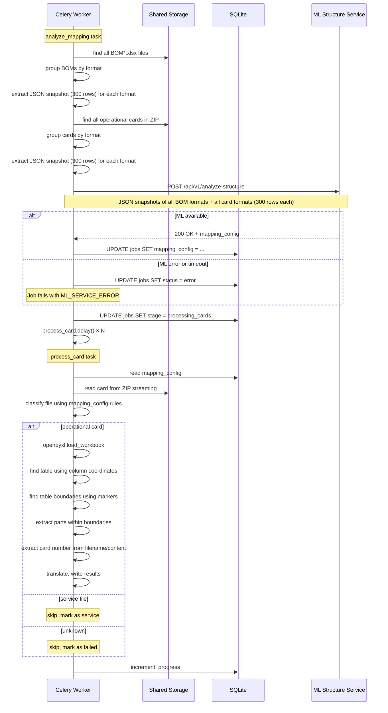

# ML-сервис анализа структуры: контракт и архитектура

> **Статус:** Черновик для обсуждения
> **Цель:** Определить, как ML-сервис будет получать данные об Excel-файлах и сообщать о структуре для нового парсера в Celery Worker

---

## 1. Контекст и предпосылки

1.  Новый парсер в Celery Worker будет целиком полагаться на `mapping_config` от ML-сервиса.
2. **BOM-файлы и операционные карты могут быть в разных форматах.** ML-сервис должен уметь определять структуру для каждого формата.
3. **Бэкенд перед отправкой в ML конвертирует Excel в данные через openpyxl.** Как это сделано в старом парсере: `openpyxl.load_workbook(file_path, data_only=True)` → чтение ячеек → формирование JSON-слепка.
4. **ML-сервис не имеет доступа к Shared Storage.** Все данные передаются через HTTP (JSON).
5. **Бэкенд отправляет несколько BOM-файлов и несколько операционных карт разных форматов.** Бэкенд группирует файлы по формату (например, по шаблону имени файла) и отправляет representative-слепок каждого уникального формата, чтобы ML-сервис точно знал все варианты структуры.

---

## 2. Как бэкенд формирует JSON-слепок для ML

### 2.1. Принцип

Бэкенд открывает Excel-файл через `openpyxl` (как в старом парсере) и извлекает:
- Имена всех листов
- Для каждого листа — первые 300 строк (сырые значения ячеек)
- Мета-информацию: количество строк, количество колонок

**Важно (группировка по форматам):** Бэкенд ищет **все** BOM-файлы (шаблон `BOM*.xlsx`) и **все** операционные карты в архиве, группирует их по формату (например, по шаблону/маске имени файла) и отправляет **representative-слепки каждого уникального формата** в ML-сервис. Это позволяет ML-сервису точно знать все варианты структуры, которые встречаются в задаче. Размер слепка — **300 строк** с каждого листа.

### 2.2. Пример реализации (новый `excel_service.py`)

```python
import openpyxl

def extract_snapshot(file_path: str, max_rows: int = 300) -> dict:
    """
    Извлечь JSON-слепок Excel-файла для отправки в ML-сервис.
    
    Args:
        file_path: Путь к .xlsx файлу.
        max_rows: Сколько строк брать с каждого листа.
    
    Returns:
        dict: {
            "file_name": "BOM.xlsx",
            "total_sheets": 3,
            "sheets": [
                {
                    "sheet_name": "总装BOM",
                    "total_rows": 1500,
                    "total_cols": 30,
                    "rows": [["A1", "B1", ...], ["A2", "B2", ...], ...]
                }
            ]
        }
    """
    wb = openpyxl.load_workbook(file_path, data_only=True)
    result = {
        "file_name": os.path.basename(file_path),
        "total_sheets": len(wb.sheetnames),
        "sheets": []
    }
    
    for sheet_name in wb.sheetnames:
        ws = wb[sheet_name]
        max_row = ws.max_row or 0
        # Ограничиваем считывание колонок до 50, чтобы избежать проблем с производительностью
        max_col = min(ws.max_column or 0, 50)
        
        rows = []
        for row_idx in range(1, min(max_rows, max_row) + 1):
            row_values = []
            for col_idx in range(1, max_col + 1):
                cell = ws.cell(row=row_idx, column=col_idx)
                value = cell.value
                # Конвертируем в строку для JSON-совместимости
                if value is None:
                    row_values.append(None)
                elif isinstance(value, (int, float)):
                    row_values.append(value)
                else:
                    row_values.append(str(value))
            rows.append(row_values)
        
        result["sheets"].append({
            "sheet_name": sheet_name,
            "total_rows": max_row,
            "total_cols": max_col,
            "rows": rows
        })
    
    wb.close()
    return result
```

### 2.3. Что попадает в JSON-слепок

| Данные | Откуда | Пример |
|--------|--------|--------|
| Имя файла | `os.path.basename(file_path)` | `"BOM.xlsx"` |
| Имя листа | `ws.title` | `"总装BOM"` |
| Всего строк | `ws.max_row` | `1500` |
| Всего колонок | `ws.max_column` | `30` |
| Значения ячеек | `ws.cell(row, col).value` | `"零件号"`, `"S1110001"`, `2` |

**Важно:** Значения передаются как есть (int, float, str, None). ML-сервис сам решает, что с ними делать.

---

## 3. Контракт ML-сервиса

### 3.1. Эндпоинт

```
POST /api/v1/analyze-structure
Content-Type: application/json
```

### 3.2. Запрос (Request)

**Важно:** `bom` и `sample_cards` — это массивы. Бэкенд группирует все BOM-файлы и все операционные карты по форматам и отправляет representative-слепок каждого уникального формата. Размер слепка — 300 строк с каждого листа.

```json
{
  "bom": [
    {
      "file_name": "BOM.xlsx",
      "format_group": "BOM_standard",
      "total_sheets": 3,
      "sheets": [
        {
          "sheet_name": "总装BOM",
          "total_rows": 1500,
          "total_cols": 30,
          "rows": [
            ["序号", "零件号", "零件名称", "零件名称(英文)", "用量", "V31", "V32", "V33"],
            [1, "S1110001", "螺栓M6×20", "Bolt M6×20", 2, "S", 1, "S"],
            [2, "S1110002", "螺母M8", "Nut M8", 4, 1, "S", 2],
            [3, "S1110003", "垫圈", "Washer", 4, "S", "S", "S"]
          ]
        },
        {
          "sheet_name": "封面",
          "total_rows": 5,
          "total_cols": 2,
          "rows": [
            ["项目", "内容"],
            ["车型", "XXX"],
            ["版本", "V1.0"]
          ]
        },
        {
          "sheet_name": "变更记录",
          "total_rows": 10,
          "total_cols": 4,
          "rows": [
            ["版本", "日期", "变更内容", "编制"],
            ["V1.0", "2024-01-01", "初版", "张三"]
          ]
        }
      ]
    },
    {
      "file_name": "BOM_export.xlsx",
      "format_group": "BOM_export",
      "total_sheets": 2,
      "sheets": [
        {
          "sheet_name": "Sheet1",
          "total_rows": 800,
          "total_cols": 15,
          "rows": [
            ["Part No", "Part Name", "Qty", "Remark"],
            ["S1110001", "Bolt M6×20", 2, null],
            ["S1110002", "Nut M8", 4, null]
          ]
        }
      ]
    }
  ],
  "sample_cards": [
    {
      "file_name": "SQRT1L-17-AS-04001.xlsx",
      "format_group": "card_format_A",
      "total_sheets": 1,
      "sheets": [
        {
          "sheet_name": "Sheet1",
          "total_rows": 300,
          "total_cols": 10,
          "rows": [
            ["序号", "零件号", "名称", "数量", "备注"],
            [1, "S1110001", "螺栓M6×20", 2, null],
            [2, "S1110004", "螺母M10", 4, null]
          ]
        }
      ]
    },
    {
      "file_name": "G01-A-AS-05001.xlsx",
      "format_group": "card_format_B",
      "total_sheets": 2,
      "sheets": [
        {
          "sheet_name": "操作1",
          "total_rows": 30,
          "total_cols": 8,
          "rows": [
            ["零件号", "名称", "数量"],
            ["S1110001", "螺栓M6×20", 2]
          ]
        },
        {
          "sheet_name": "操作2",
          "total_rows": 25,
          "total_cols": 8,
          "rows": [
            ["零件号", "名称", "数量"],
            ["S1110005", "螺钉M4", 6]
          ]
        }
      ]
    }
  ],
  "options": {
    "max_sample_rows": 300,
    "total_cards_in_archive": 1000,
    "language_hint": "zh-CN"
  }
}
```

### 3.3. Ответ (Response) — `200 OK`

ML-сервис возвращает `mapping_config` — полное описание структуры для парсера.

```json
{
  "status": "success",
  "mapping_config": {
    "bom": {
      "sheets": [
        {
          "sheet_name": "总装BOM",
          "sheet_type": "bom_data",
          "header_rows": [1],
          "data_start_row": 2,
          "total_data_rows_estimate": 1500,
          "columns": {
            "part_no": {
              "col_index": 2,
              "header": "零件号",
              "confidence": 0.98
            },
            "name_cn": {
              "col_index": 3,
              "header": "零件名称",
              "confidence": 0.95
            },
            "name_en": {
              "col_index": 4,
              "header": "零件名称(英文)",
              "confidence": 0.92
            },
            "qty": {
              "col_index": 5,
              "header": "用量",
              "confidence": 0.97
            },
            "config_columns": [
              {
                "col_index": 6,
                "header": "V31",
                "type": "config",
                "confidence": 0.90
              },
              {
                "col_index": 7,
                "header": "V32",
                "type": "config",
                "confidence": 0.90
              },
              {
                "col_index": 8,
                "header": "V33",
                "type": "config",
                "confidence": 0.90
              }
            ]
          },
          "layout": {
            "type": "single_table",
            "description": "Стандартная таблица BOM"
          }
        },
        {
          "sheet_name": "封面",
          "sheet_type": "service",
          "header_rows": [],
          "data_start_row": 0,
          "columns": {},
          "layout": {
            "type": "service_sheet",
            "description": "Служебный лист обложка"
          }
        },
        {
          "sheet_name": "变更记录",
          "sheet_type": "service",
          "header_rows": [],
          "data_start_row": 0,
          "columns": {},
          "layout": {
            "type": "service_sheet",
            "description": "Служебный лист история изменений"
          }
        }
      ]
    },
    "cards": {
      "formats": {
        "card_format_A": {
          "structure_type": "standard_table",
          "description": "Операционные карты со стандартной таблицей деталей. Номер карты извлекается из имени файла по паттерну Префикс-AS-Номер.",
          "card_number_source": "filename",
          "card_number_pattern": "^[A-Za-z0-9]+-[A-Za-z0-9]*-AS-\\d+",
          "card_number_confidence": 0.92,
          "sheets": [
            {
              "sheet_name": null,
              "sheet_type": "card_data",
              "header_rows": [1],
              "data_start_row": 2,
              "columns": {
                "part_no": {
                  "col_index": 2,
                  "header": "零件号",
                  "confidence": 0.95
                },
                "name_cn": {
                  "col_index": 3,
                  "header": "名称",
                  "confidence": 0.90
                },
                "qty": {
                  "col_index": 4,
                  "header": "数量",
                  "confidence": 0.97
                }
              },
              "table_boundaries": {
                "type": "end_markers",
                "markers": ["物料清单", "变更记录", "编制", "校对", "审核", "批准"],
                "empty_rows_threshold": 3
              }
            }
          ]
        },
        "card_format_B": {
          "structure_type": "standard_table",
          "description": "Технологические карты 工艺卡片. Один файл содержит несколько карт, разделённых пустой строкой.",
          "card_number_source": "cell",
          "card_number_pattern": "CM-[A-Z0-9]+",
          "card_number_confidence": 0.90,
          "sheets": [
            {
              "sheet_name": null,
              "sheet_type": "card_data",
              "header_rows": [1],
              "data_start_row": 2,
              "columns": {
                "part_no": {
                  "col_index": 18,
                  "header": "零部件代号",
                  "confidence": 0.95
                },
                "name_cn": {
                  "col_index": 0,
                  "header": null,
                  "confidence": 0.0
                },
                "qty": {
                  "col_index": 0,
                  "header": null,
                  "confidence": 0.0
                }
              },
              "table_boundaries": {
                "type": "multi_card",
                "multi_card": {
                  "separator_type": "empty_row",
                  "empty_rows_separator": 1,
                  "has_repeating_header": true,
                  "parts_header_row": 1,
                  "parts_data_start_row": 2,
                  "max_cards": 0
                }
              }
            }
          ]
        }
      },
      "file_classification_rules": {
        "operational_card_patterns": [
          {
            "type": "filename_regex",
            "pattern": "^[A-Za-z0-9]+-[A-Za-z0-9]*-AS-\\d+",
            "format_group": "card_format_A"
          },
          {
            "type": "filename_regex",
            "pattern": "^[A-Za-z]{1,3}\\d{2,}",
            "format_group": "card_format_A"
          },
          {
            "type": "filename_regex",
            "pattern": "^\\d{2,}",
            "format_group": "card_format_A"
          },
          {
            "type": "sheet_keyword",
            "keywords": ["作业指导书", "作业要领书", "操作指导", "工艺卡", "工序卡"],
            "format_group": "card_format_A"
          }
        ],
        "service_file_patterns": [
          {
            "type": "filename_keyword",
            "keywords": ["封面", "目录", "记录表", "空表", "填写范本", "填写说明", "工时汇总", "对比"]
          },
          {
            "type": "filename_keyword",
            "keywords": ["обложка", "содержание", "cover", "toc", "template"]
          }
        ]
      }
    },
    "mapping": {
      "bom_to_card": {
        "part_no": {
          "bom_column": "part_no",
          "card_column": "part_no",
          "match_type": "exact",
          "confidence": 0.95
        },
        "name": {
          "bom_column": "name_cn",
          "card_column": "name_cn",
          "match_type": "fuzzy",
          "confidence": 0.90
        },
        "quantity": {
          "bom_column": "qty",
          "card_column": "qty",
          "match_type": "exact",
          "confidence": 0.97
        }
      }
    },
    "metadata": {
      "analyzer_version": "1.0.0",
      "processing_time_ms": 450,
      "model": "gpt-4o",
      "warnings": [
        "Не удалось определить name_en для карт"
      ]
    }
  }
}
```

---

## 4. Как mapping_config используется парсером

### 4.1. Analyze Mapping Task (отправляет в ML, сохраняет результат)

```python
def analyze_mapping(job_id):
    # 1. Ищем все BOM-файлы, группируем по формату, делаем JSON-слепки (300 строк)
    bom_paths = get_all_bom_paths(job_id)  # все BOM*.xlsx
    bom_groups = group_by_format(bom_paths)  # группировка по шаблону имени
    bom_snapshots = []
    for group_name, paths in bom_groups.items():
        snapshot = extract_snapshot(paths[0], max_rows=300)  # representative
        snapshot["format_group"] = group_name
        bom_snapshots.append(snapshot)
    
    # 2. Ищем все операционные карты в архиве, группируем по формату, делаем JSON-слепки
    # Считываем данные в BytesIO, исключая ненужную запись на диск
    all_card_paths = get_all_card_paths(job_id)
    card_groups = group_by_format(all_card_paths)
    card_snapshots = []
    for group_name, paths in card_groups.items():
        card_data = read_card_from_zip(job_id, paths[0])
        snapshot = SnapshotService.extract_snapshot_from_bytes(
            card_data, os.path.basename(paths[0]), max_rows=300
        )
        snapshot["format_group"] = group_name
        card_snapshots.append(snapshot)
    
    # 3. Отправляем в ML-сервис
    try:
        response = ml_client.post(
            "/api/v1/analyze-structure",
            json={
                "bom": bom_snapshots,
                "sample_cards": card_snapshots,
                "options": {
                    "max_sample_rows": 300,
                    "total_cards_in_archive": len(all_card_paths)
                }
            }
        )
        mapping_config = response["mapping_config"]
    except Exception as e:
        logger.error(f"ML service failed: {e}")
        mark_job_error(job_id, f"ML_SERVICE_ERROR: {e}")
        return
    
    # 4. Сохраняем в БД (синхронно, используя sync_repository)
    sync_repository.update_mapping_config(job_id, mapping_config)
    
    # 5. Запускаем обработку карт
    sync_repository.update_job_status(job_id, "processing", "processing_cards")
    for card_path in all_card_paths:
        process_card.delay(job_id, card_path)
```

### 4.2. Process Card Task (использует mapping_config для парсинга)

```python
def process_card(job_id, card_path):
    # 1. Получаем mapping_config (синхронно через sync_repository)
    mapping = sync_repository.get_mapping_config(job_id)
    card_mapping = mapping["cards"]
    
    # 2. Классифицируем файл по правилам из mapping_config
    classification, format_group = classify_file(card_path, card_mapping["file_classification_rules"])
    
    if classification == "service":
        # Служебный файл — пропускаем
        sync_repository.increment_progress(job_id, card_path, success=True)
        return
    
    if classification == "unknown":
        # Неизвестный формат — помечаем как failed
        sync_repository.increment_progress(
            job_id, card_path, success=False, 
            error_message="Unknown file format, cannot parse"
        )
        return
    
    try:
        # 3. Открываем карту из ZIP (streaming) в BytesIO
        card_data = read_card_from_zip(job_id, card_path)
        wb = openpyxl.load_workbook(io.BytesIO(card_data), data_only=True)
        
        # Находим настройки парсинга для сопоставленной группы формата
        format_config = card_mapping["formats"][format_group]
        
        # 4. Для каждого листа — ищем таблицу деталей по mapping_config
        parts = []
        for sheet_name in wb.sheetnames:
            ws = wb[sheet_name]
            
            # Определяем, есть ли на этом листе таблица деталей
            sheet_mapping = find_sheet_mapping(sheet_name, format_config["sheets"])
            if not sheet_mapping:
                continue
            
            # Берём координаты из mapping_config
            part_no_col = sheet_mapping["columns"]["part_no"]["col_index"]
            name_col = sheet_mapping["columns"]["name_cn"]["col_index"]
            qty_col = sheet_mapping["columns"]["qty"]["col_index"]
            data_start = sheet_mapping["data_start_row"]
            
            # Определяем границы таблицы
            end_row = find_table_end(
                ws, data_start, 
                boundaries_config=sheet_mapping["table_boundaries"]
            )
            
            # Извлекаем данные
            for row in range(data_start, end_row + 1):
                part_no = ws.cell(row=row, column=part_no_col).value
                if part_no is None:
                    continue
                qty = ws.cell(row=row, column=qty_col).value
                name = ws.cell(row=row, column=name_col).value
                parts.append({
                    "part_no": str(part_no).strip(),
                    "name": str(name).strip() if name else "",
                    "qty": normalize_quantity(qty)
                })
        
        # 5. Извлекаем номер карты
        card_number = extract_card_number(card_path, format_config)
        
        # 6. Сохраняем результаты
        save_card_results(job_id, card_path, card_number, parts)
        
        # 7. Инкрементируем прогресс (success=True)
        progress = sync_repository.increment_progress(job_id, card_path, success=True)
        if progress.is_complete:
            aggregate.delay(job_id)
            
    except Exception as e:
        # Ловим любые ошибки парсинга, чтобы не ломать очередь, и помечаем карту как failed
        logger.error(f"Failed to process card {card_path}: {e}")
        progress = sync_repository.increment_progress(
            job_id, card_path, success=False, error_message=str(e)
        )
        if progress.is_complete:
            aggregate.delay(job_id)
```

---

## 5. Полная спецификация mapping_config

### 5.1. Структура верхнего уровня

```typescript
interface MappingConfig {
  /** Информация о структуре BOM */
  bom: BomStructure;
  
  /** Информация о структуре операционных карт */
  cards: CardsStructure;
  
  /** Маппинг полей BOM → карты */
  mapping: {
    bom_to_card: Record<string, FieldMapping>;
  };
  
  /** Метаданные */
  metadata: {
    analyzer_version: string;
    processing_time_ms: number;
    model: string;
    warnings: string[];
  };
}
```

### 5.2. BOM Structure

```typescript
interface BomStructure {
  sheets: BomSheetMapping[];
}

interface BomSheetMapping {
  /** Имя листа как в Excel */
  sheet_name: string;
  
  /** Тип листа */
  sheet_type: "bom_data" | "service" | "unknown";
  
  /** Номера строк-заголовков (1-based) */
  header_rows: number[];
  
  /** Строка, с которой начинаются данные (1-based) */
  data_start_row: number;
  
  /** Оценка количества строк данных */
  total_data_rows_estimate: number;
  
  /** Описание колонок */
  columns: {
    part_no: ColumnMapping;
    name_cn: ColumnMapping;
    name_en: ColumnMapping;
    qty: ColumnMapping;
    config_columns: ConfigColumnMapping[];
  };
  
  /** Описание layout'а листа */
  layout: {
    type: "single_table" | "multi_block" | "service_sheet";
    description: string;
    /** Для multi_block: описание каждого блока */
    blocks?: Array<{
      part_no_col: number;
      name_col: number;
      qty_col: number;
      start_col: number;
      end_col: number;
    }>;
  };
}
```

### 5.3. Cards Structure

```typescript
interface CardsStructure {
  /** Форматы карт, сгруппированные по format_group */
  formats: Record<string, CardFormatMapping>;
  
  /** Правила классификации файлов в архиве */
  file_classification_rules: {
    operational_card_patterns: ClassificationPattern[];
    service_file_patterns: ClassificationPattern[];
  };
}

interface CardFormatMapping {
  /** Тип структуры карт */
  structure_type: "standard_table" | "graphic_number" | "inspection" | "unknown";
  
  /** Человекочитаемое описание */
  description: string;
  
  /** Откуда извлекать номер карты */
  card_number_source: "filename" | "sheet_content" | "header" | "cell";
  
  /** Паттерн номера карты (регулярное выражение) */
  card_number_pattern: string;
  
  /** Уверенность в определении номера карты */
  card_number_confidence: number;
  
  /** Типовое описание листов карты для этого формата */
  sheets: CardSheetMapping[];
}

interface CardSheetMapping {
  /** Имя листа (null = любой лист, применимо ко всем) */
  sheet_name: string | null;
  
  /** Тип листа */
  sheet_type: "card_data" | "service" | "unknown";
  
  /** Номера строк-заголовков */
  header_rows: number[];
  
  /** Строка начала данных */
  data_start_row: number;
  
  /** Описание колонок */
  columns: {
    part_no: ColumnMapping;
    name_cn: ColumnMapping;
    name_en?: ColumnMapping;
    qty: ColumnMapping;
  };
  
  /** Как определять границы таблицы */
  table_boundaries: {
    type: "end_markers" | "empty_rows" | "next_header" | "fixed_count" | "multi_card";
    markers?: string[];
    empty_rows_threshold?: number;
    fixed_count?: number;

    /** Конфигурация для multi_card: один лист содержит несколько карт вертикально */
    multi_card?: {
      /** Тип разделителя между картами */
      separator_type: "empty_row" | "marker" | "empty_row_or_marker";

      /** Сколько пустых строк подряд считаются разделителем между картами (по умолчанию 1) */
      empty_rows_separator?: number;

      /** Маркеры, которые обозначают конец карты */
      card_end_markers?: string[];

      /** Есть ли у каждой карты свой заголовок (header) */
      has_repeating_header: boolean;

      /** Строка, где начинается таблица деталей внутри карты (относительная от начала карты, 1-based) */
      parts_header_row?: number;

      /** Строка, где начинаются данные деталей внутри карты (относительная от начала карты, 1-based) */
      parts_data_start_row?: number;

      /** Максимальное количество карт (0 = не ограничено) */
      max_cards?: number;
    };
  };
}
```

### 5.4. Общие типы

```typescript
interface ColumnMapping {
  /** 1-based номер колонки (0 = не найдена) */
  col_index: number;
  /** Текст заголовка (null если заголовка нет) */
  header: string | null;
  /** Уверенность 0.0 - 1.0 */
  confidence: number;
}

interface ConfigColumnMapping extends ColumnMapping {
  /** Тип колонки комплектации */
  type: "config" | "vin_split";
}

interface ClassificationPattern {
  /** Тип паттерна */
  type: "filename_regex" | "filename_keyword" | "sheet_keyword";
  /** Значение паттерна (для filename_regex) */
  pattern?: string;
  /** Ключевые слова (для filename_keyword / sheet_keyword) */
  keywords?: string[];
  /** Имя группы формата при совпадении (только для operational_card_patterns) */
  format_group?: string;
}

interface FieldMapping {
  /** Ключ в bom.sheets[].columns */
  bom_column: string;
  /** Ключ в cards.sheets[].columns */
  card_column: string;
  /** Тип сопоставления */
  match_type: "exact" | "fuzzy" | "regex";
  /** Уверенность */
  confidence: number;
}
```

---

## 6. Формат ошибок ML-сервиса

```json
{
  "status": "error",
  "error": {
    "code": "INVALID_INPUT",
    "message": "BOM data is empty or malformed",
    "detail": {
      "missing_fields": ["bom[0].sheets"]
    }
  }
}
```

| Код | HTTP | Описание |
|-----|------|----------|
| `INVALID_INPUT` | 422 | Неверный формат запроса |
| `ANALYSIS_FAILED` | 500 | ML не смог проанализировать структуру |
| `TIMEOUT` | 504 | Превышено время обработки |
| `RATE_LIMITED` | 429 | Слишком много запросов |

---

## 7. Изменения в бэкенде

### 7.1. Новый файл: `app/services/snapshot_service.py`

Сервис для извлечения JSON-слепков из Excel-файлов через openpyxl.

**Группировка по форматам:** Бэкенд ищет все BOM-файлы (`BOM*.xlsx`) и все операционные карты в ZIP-архиве, группирует их по формату (по шаблону/маске имени файла) и вызывает `extract_snapshot` для representative-файла каждой группы. Размер слепка — 300 строк с каждого листа.

```python
class SnapshotService:
    """Извлекает JSON-слепки из Excel-файлов для отправки в ML-сервис."""
    
    @staticmethod
    def extract_snapshot(file_path: str, max_rows: int = 300) -> dict:
        """Открыть .xlsx через openpyxl, извлечь первые N строк каждого листа."""
        ...
    
    @staticmethod
    def extract_snapshot_from_bytes(data: bytes, filename: str, max_rows: int = 300) -> dict:
        """То же самое, но из байтового потока (для карт из ZIP)."""
        ...
    
    @staticmethod
    def group_by_format(file_paths: list[str]) -> dict[str, list[str]]:
        """Сгруппировать файлы по формату (по шаблону имени).
        Возвращает словарь {format_group_name: [file_paths]}."""
        ...
```

### 7.2. Новый файл: `app/services/structure_adapter.py`

HTTP-клиент для ML-сервиса анализа структуры.

```python
class StructureAdapter:
    """HTTP-клиент для ML-сервиса анализа структуры Excel."""
    
    def __init__(self, ml_service_url: str):
        self.base_url = ml_service_url
        self.client = httpx.AsyncClient(timeout=60.0)
    
    async def analyze_structure(
        self,
        bom_snapshots: list[dict],      # несколько BOM разных форматов
        card_snapshots: list[dict],     # несколько операционных карт разных форматов
        options: dict | None = None,
    ) -> dict:
        """Отправить JSON-слепки в ML-сервис и получить mapping_config."""
        ...
```

### 7.3. Изменения в `app/worker/tasks/analyze_mapping.py`

- Использовать `SnapshotService` для извлечения JSON-слепков
- **Группировать BOM-файлы и операционные карты по форматам** перед отправкой в ML
- **Размер слепка — 300 строк** с каждого листа (параметр `max_rows=300`)
- Использовать `StructureAdapter` для вызова ML
- Graceful degradation: ошибка ML → статус `error`
- Сохранять mapping_config через `repository.update_mapping_config()`

### 7.4. Новый файл: `app/services/card_parser_service.py`

Новый парсер для операционных карт, который:
- Принимает `mapping_config` и путь к карте в ZIP
- Классифицирует файл по правилам из mapping_config
- Находит таблицу деталей по координатам из mapping_config
- Определяет границы таблицы (по маркерам / пустым строкам)
- Извлекает номер карты

### 7.5. Изменения в `app/worker/tasks/process_card.py`

- Использовать `card_parser_service.py` вместо старого `burlak_parser`
- Читать mapping_config из БД
- Передавать mapping_config в парсер

### 7.6. Конфигурация (`app/core/config.py`)

```python
ml_structure_url: str = "http://ml-structure-service:8000"
```

---

## 8. Диаграмма последовательности



---

## 9. Вопросы для обсуждения

1. **Сколько sample-карт отправлять?** Бэкенд группирует все операционные карты по форматам и отправляет по одному representative-слепку каждого формата. Если карты имеют разную структуру — ML должен указать это в `warnings` и вернуть несколько вариантов `sheets` в `file_classification_rules`.

2. **Как быть с картами, структура которых отличается от типовой?** ML возвращает `file_classification_rules` с паттернами. Если карта не соответствует ни одному паттерну — парсер помечает её как `unknown` и пропускает (failed).

3. **Нужна ли версионность mapping_config?** Да, `metadata.analyzer_version` позволит отслеживать, какой версией ML был сгенерирован конфиг.

4. **Как часто обновлять mapping_config?** Один раз на задачу (в `analyze_mapping`). Если ML-модель обновилась — только для новых задач.

5. **Что если в архиве есть карты разных форматов?** ML должен определить это по sample-картам и вернуть несколько вариантов `sheets` в `cards.structure`. Парсер будет перебирать варианты, пока не найдёт подходящий.


